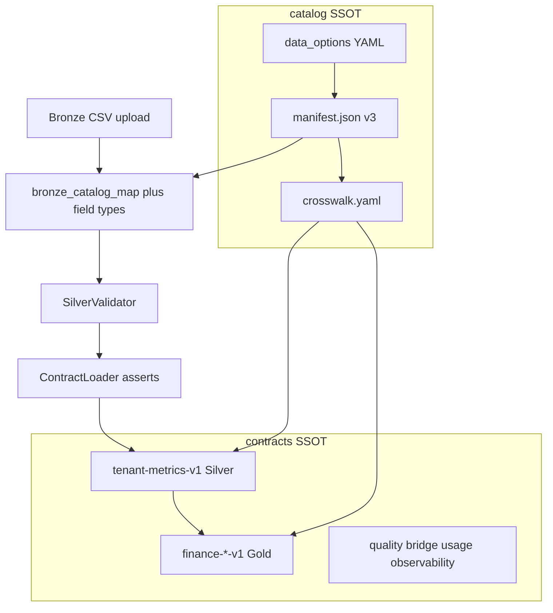

# Data-product contracts

YAML in this directory is the **single source of truth** for governed data-product interfaces in Ambient Core. Wheels bundle copies under `lib/ambient_contracts/bundled/`; CI fails if bundled files drift from this tree.

## For integrators

Read [docs/governed-data.md](../docs/governed-data.md) for how contracts interact with the catalog and lakehouse jobs.

**Do not** maintain a parallel `contracts/` tree in your application repository. Pin a tagged core release and set `AMBIENT_CONTRACTS_DIR` to the submodule or clone path — [docs/INTEGRATING.md](../docs/INTEGRATING.md).

## How catalog and contracts connect

The **catalog** describes KPI intent, upload templates, and typed input fields. **Contracts** define the columns, lineage, and governance rules for persisted Silver and Gold products. They are complementary SSOT layers — not duplicates.

1. **Upload shape** — Industry `data_options.yaml` and manifest **v3** export typed `fields`, `fieldCoverage` (`upload` or `enumerated`), `collectionFrequency`, and metric `frequency`. Pipeline mapping uses these names and types ([docs/catalog-consumption.md](../docs/catalog-consumption.md), [docs/catalog-input-field-gaps.md](../docs/catalog-input-field-gaps.md)).
2. **Bronze → Silver** — After catalog mapping and provenance stamping, rows conform to [**tenant-metrics-v1.yaml**](tenant-metrics-v1.yaml): multi-tenant Silver snapshots with bronze lineage columns.
3. **Silver → Gold** — Vertical rollups use domain products (`finance-*-v1`, healthcare, life sciences, org-kpi). Several catalog industry packs can map to one `finance-*` contract via book segments and `product_line` — see [catalog/crosswalk.yaml](../catalog/crosswalk.yaml).
4. **Crosswalk** — Optional links from manifest metric keys to `contractFile` and `contractProductId` for apps and docs; for documentation and adapter wiring ([docs/crosswalk.md](../docs/crosswalk.md)).
5. **Quality** — Post-ingest quality remains pipeline + contracts (Silver validation, Gold contracts).

End-to-end job steps: [docs/pipeline.md](../docs/pipeline.md).

**Silver → Gold (platform):** Core supplies [`ambient_calc`](../lib/ambient_calc/__init__.py) and [`gold_contract_map`](../lib/ambient_pipeline/gold_contract_map.py) to relate crosswalk metric keys to Gold contract columns; Spark jobs that write `finance-*` or healthcare tables live in your application repo.

Gold **finance-*-v1** contracts map to metrics across Banking, Commercial Finance, Consumer Finance, Financial Services, Funds, Trusts, and Insurance catalog packs. Credit, liquidity, market, and payment-volume metrics are columns on the matching `finance-*` product for that economic engine — not separate risk or payments contract files.

## Current data products

### Platform and medallion

- **`tenant-metrics-v1.yaml`** — Silver tenant metrics; multi-tenant isolation; bronze provenance
- **`org-kpi-v1.yaml`** — Gold org KPIs; business-level outcomes by vertical
- **`quality-v1.yaml`** — Data quality and lineage; observability product
- **`operational-financial-bridge-v1.yaml`** — Operational–financial bridge; cross-domain reconciliation
- **`commercial-usage-v1.yaml`** — Commercial usage snapshot; billing and consumption metering
- **`observability-pipeline-v1.yaml`** — Pipeline and medallion observability; may reference platform deploy assets

### Healthcare

- **`healthcare-provider-ops-v1.yaml`** — De-identified provider operations; volume, throughput, occupancy, staffing, unit cost
- **`healthcare-revenue-cycle-v1.yaml`** — De-identified revenue cycle; denials, clean-claim rates, AR days by payer category
- **`healthcare-quality-outcomes-v1.yaml`** — Cohort-level quality outcomes; readmissions, mortality, infection rates

### Life sciences

- **`life-sciences-rnd-v1.yaml`** — Aggregated R&D pipeline; trial cost per patient, phase success

### Finance (by economic engine)

- **`finance-banking-v1.yaml`** — Deposit-taking banking; NIM, NPL, loan-to-deposit, efficiency, tier-1 capital
- **`finance-commercial-finance-v1.yaml`** — C&I and middle-market commercial loan book; yield, NPL, charge-offs, delinquency by book segment
- **`finance-consumer-finance-v1.yaml`** — Consumer lending, BNPL, embedded finance, payments, residential mortgage by `product_line`
- **`finance-investment-banking-v1.yaml`** — Investment banking and markets; trading and advisory mix, VaR, counterparty, prime brokerage, venue volume
- **`finance-funds-v1.yaml`** — Pooled and institutional funds; AUM, flows, fees, closed-end performance, custody
- **`finance-private-capital-ops-v1.yaml`** — Private-capital GP operations; sourcing, deployment, portfolio, co-investment, fundraising funnel
- **`finance-trusts-v1.yaml`** — Trust and listed REIT vehicles; FFO, payout, vehicle same-store NOI, trustee administration
- **`finance-insurance-v1.yaml`** — P&C and life underwriting; reserve development and catastrophe loss ratio

For table names, required columns, and consumption rules, read each product YAML. Structural validation does not replace pipeline semantics or platform entitlements.

## Authoring and validation

New or changed contracts must include top-level sections **`product`**, **`schema`**, **`lineage`**, and **`governance`**. The `product` section requires `name`, `version`, and `owner`. Optional sections include `quality`, `freshness`, `firestore`, and `consumption_contract` with additional rules in the validator. Filenames follow `{product-slug}-v{MAJOR}.yaml` and must match the major component of `product.version` — [docs/CONVENTIONS.md](../docs/CONVENTIONS.md#contract-files-and-versions).

Workflow:

1. Edit YAML under `contracts/`.
2. Run `validate-contracts` locally (rules in [lib/ambient_contracts/validate.py](../lib/ambient_contracts/validate.py)).
3. Run `python scripts/check_contract_schema.py` against [schema/contract-v1.json](schema/contract-v1.json).
4. Sync bundled copies: `cp contracts/*.yaml lib/ambient_contracts/bundled/` — [docs/CONTRIBUTING.md](../docs/CONTRIBUTING.md#contract-changes).
5. Release only after CI passes contract validation and bundled parity checks.

**Runtime:** `ContractLoader` in [lib/ambient_contracts/loader.py](../lib/ambient_contracts/loader.py) loads YAML and enforces bronze lineage and required-column checks on Spark DataFrames before Silver/Gold writes.

## Related

- [docs/governed-data.md](../docs/governed-data.md) — consumption, paths, agents, anti-patterns
- [docs/pipeline.md](../docs/pipeline.md) — bronze → contract flow with `ambient_pipeline`
- [docs/crosswalk.md](../docs/crosswalk.md) — metric → contract links
- [docs/CONVENTIONS.md](../docs/CONVENTIONS.md) — contract versions and storage formats
- [docs/CANONICAL_SCOPE.md](../docs/CANONICAL_SCOPE.md) — what must change only in this repo
