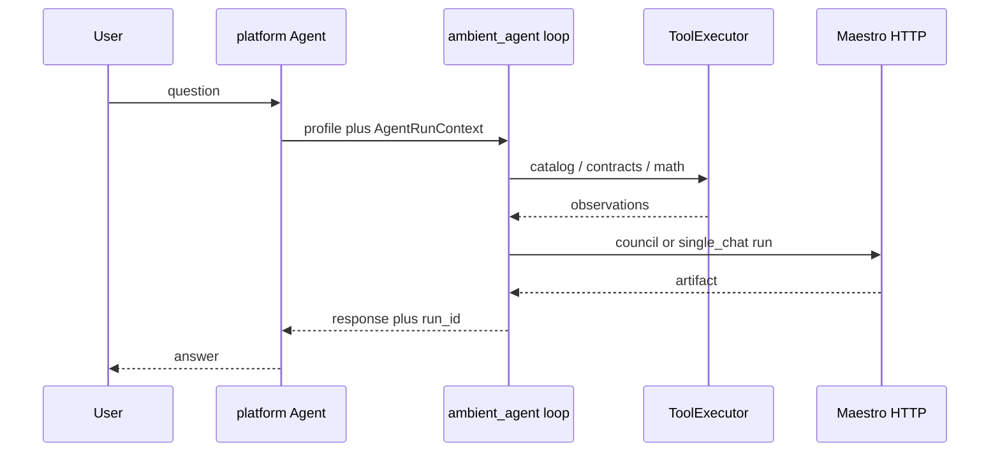

# Agents and agentic workflows

Ambient Core ships **governed data**, **Maestro inference**, and a **plan-execute agent runtime** in `ambient_agent`. Tenant UI, commercial tools, and production secrets belong in your application repository (for example [ambient-systems-platform](https://github.com/Ambient-Team/ambient-systems-platform)).

## End-to-end flow



- **Maestro** owns routing, council, and `POST /v1/runs` — do not reimplement `Router` / `CouncilEngine` in `ambient_agent`.
- **`ambient_agent`** picks a **profile**, runs **core tools** in order, then **one synthesis Maestro run** with observations in the prompt.
- **Your app** supplies tenancy, UI, and optional tools via `register_tool()` at process startup.

## Documentation conventions

When editing markdown in this repository (`docs/`, READMEs, `examples/**/*.md`), use **prose and bullet lists**, not markdown pipe tables. Example: `- **contracts/** — SSOT for data-product YAML.` CI checks with `python scripts/check_markdown_prose.py`. See [CONTRIBUTING.md](CONTRIBUTING.md#documentation-style).

## Declarative config (core)

- [`lib/ambient_agent/tool_definitions.yaml`](../lib/ambient_agent/tool_definitions.yaml) — core tool ids, parameters, descriptions
- [`lib/ambient_agent/agent_profiles.yaml`](../lib/ambient_agent/agent_profiles.yaml) — agent types: Maestro mode, `task_type`, ordered `tool_ids`
- [`lib/ambient_inference/default_config/council_profiles.yaml`](../lib/ambient_inference/default_config/council_profiles.yaml) — council modes referenced by profile `maestro_mode`

Validate after edits:

```bash
validate-agent-config
validate-inference-registry
```

**Plan-execute v1:** each profile runs its `tool_ids` **once** per `run_plan_execute` call. `max_tool_rounds` in `agent_profiles.yaml` is **reserved** for future ReAct / LLM-parsed tool loops; the loop does not read it today.

## Agent types (profiles)

- **`researcher`** — Maestro `council_research`, typical router task `research_qa`; core tools: catalog_*, `contracts_list`. Platform adds metrics/OLAP tools.
- **`analyst`** — `single_chat`, `general_chat`; `catalog_resolve_metric`, `structured_json`. Platform adds fulfillment / tenant metrics.
- **`auditor`** — `single_chat`, `general_chat`; `contracts_validate`, `contracts_list`. Platform adds policy store / tickets.
- **`summarizer`** — `council_research` or `single_chat`; catalog_*, Maestro synthesis via loop. Platform adds doc sources.
- **`optimizer`** — `council_research`, `research_qa`; `contracts_list`, catalog_*. Platform adds pipeline triggers.

**Not in core YAML:** web search, Firestore writes, Databricks job triggers, `metricFulfillment`, billing — implement in the platform repo and register at runtime.

## Runtime API (Python)

```python
from ambient_agent import run_plan_execute, register_tool, AgentRunContext

register_tool("my_tenant_metric", my_handler)  # platform only

result = run_plan_execute(
    profile_id="auditor",
    user_message="Validate contract X",
    context=AgentRunContext(run_id="...", metadata={"org_id": "..."}),
)
# result.content, result.run_id, result.observations
```

### Live agent E2E

Full **plan-execute → tools → Maestro synthesis** runs are gated by the `agent_e2e` pytest marker (excluded from default `pytest` via `addopts` in `pyproject.toml`).

1. Install test deps (includes `httpx` for Maestro HTTP): `pip install -e ".[inference,dev]"` (or `.[all]`). Use Python 3.10–3.12 (`requires-python` in `pyproject.toml`).
2. Start Maestro with at least one inference backend ([inference-layer.md](inference-layer.md)).
3. Optional env: `MAESTRO_E2E_URL` (default `http://127.0.0.1:8088`), `AMBIENT_MAESTRO_API_KEY`.
4. Run: `pytest -m agent_e2e -q` or `pytest tests/test_agent_e2e.py -m agent_e2e -q`.

Tests skip gracefully when Maestro is unreachable or `/ready` reports no backends.

Modules: `tools.py` (built-ins), `registry.py` (`register_tool`), `executor.py`, `maestro_client.py`, `loop.py` (`run_plan_execute`). Direct calls to the `maestro_run` tool id are blocked; synthesis goes through the loop.

### Plan-execute tool arguments (v1)

`run_plan_execute` does **not** parse tool calls from an LLM. It walks the profile’s fixed `tool_ids` list and supplies arguments via built-in defaults in `loop.py` (for example `catalog_resolve_metric` uses a truncated copy of `user_message` as `metric_id`). Registered platform tools invoked through `run_plan_execute` receive an empty `{}` args dict unless the loop is extended. For tools that need explicit inputs, call `execute(tool_id, args, context, trace)` directly from your worker code.

### Tool registry (process scope)

`register_tool()` uses a **single process-global** namespace: not isolated per tenant or per run. Registering the same `tool_id` twice raises `ValueError`. Call `clear_extensions()` in tests. Intended for worker/API startup (see platform extensions below), not per-request registration in a multi-tenant process without a reload strategy.

**Phase 2 (not in v0.2.3):** ReAct loops with LLM-parsed tool calls require Maestro `CreateRunRequest` tool-calling support.

## Three layers (do not merge them)

**1. Governed data (contracts + catalog + pipeline)**  
Agents read published Gold shapes and catalog definitions via core tools—not ad-hoc KPI logic in prompts.

**2. Maestro (`ambient_inference`, HTTP service)**  
Model routing, registry, council. See [inference-layer.md](inference-layer.md).

**3. Application agents (downstream repos)**  
Org context, session state, human-in-the-loop UI, and **registered** tools for your OLTP/OLAP.

## Governed data tools

Core built-ins read **published** catalog and contract metadata from disk (YAML source tree and generated **JSON** manifest). They do not query live Gold tables, forward Parquet/Delta stores, or run Spark jobs — use `register_tool()` in your platform for those ([CONVENTIONS.md](CONVENTIONS.md), [governed-data.md](governed-data.md)).

- **`catalog_list_metrics` / `catalog_resolve_metric`** — metric definitions, industries, methodology
- **`contracts_list` / `contracts_validate`** — governed product inventory and structural validation

Details, path env vars, and crosswalk: [governed-data.md](governed-data.md).

`run_plan_execute` passes default tool args derived from `user_message` (for example the first 128 characters as `metric_id` for `catalog_resolve_metric`). Production workers should call `execute()` with explicit args when inputs are not the raw user string — see [loop.py](../lib/ambient_agent/loop.py).

Optional `AgentRunContext.contract_refs` and `catalog_refs` are copied into the synthesis prompt as policy hints; they do not block tools or replace your authZ layer.

## Production hardening

Core does not authenticate end users or isolate tenants in the tool registry. Before exposing agents in production, read [agent-security.md](agent-security.md) (threat model and application checklist).

## Platform extensions

In **ambient-systems-platform** (or your fork):

1. Depend on a tagged **ambient-core** release.
2. At worker/API startup, `from ambient_agent import register_tool` and bind Firestore, Databricks, or commercial helpers.
3. Call `run_plan_execute(profile_id=..., ...)` from a Cloud Function, Python worker, or batch job—not from the browser with secrets.

Platform consumer flow: [ambient-systems-platform `docs/ambient-core.md`](https://github.com/Ambient-Team/ambient-systems-platform/blob/main/docs/ambient-core.md). Optional platform note: [`docs/agents.md`](https://github.com/Ambient-Team/ambient-systems-platform/blob/main/docs/agents.md) (agents run in platform; core supplies profiles/tools loop).

## When to put code here vs downstream

**Put in ambient-core**

- Maestro behavior, registry YAML, `maestro-run-v1`.
- Neutral tool definitions and plan-execute loop.
- Cross-product agent artifacts and validation.

**Put in your application repo**

- Tenant paths, entitlements, vendor SDKs.
- Tools that trigger **your** deploy pipelines or internal APIs.
- Browser-facing flows and end-user API keys.

## Integrators (open source)

1. Pin a tagged release ([INTEGRATING.md](INTEGRATING.md)).
2. Run Maestro and set backend env vars ([inference-layer.md](inference-layer.md)).
3. Use `run_plan_execute` or import boundaries (`AgentRunContext`, `InferenceClient` protocol).
4. Register app-specific tools; keep contract references and Maestro **run IDs** in logs.

## Related

- [governed-data.md](governed-data.md) — catalog and contracts for agents, UI, and jobs
- [CONVENTIONS.md](CONVENTIONS.md) — formats, storage, and catalogue naming
- [agent-security.md](agent-security.md) — production threat model and checklist
- [ECOSYSTEM.md](ECOSYSTEM.md) — components and release flow
- [CANONICAL_SCOPE.md](CANONICAL_SCOPE.md) — exclusive scope
- [inference-layer.md](inference-layer.md) — Maestro operations
- [examples/integrations/openclaw/README.md](../examples/integrations/openclaw/README.md) — external assistant shell pattern
