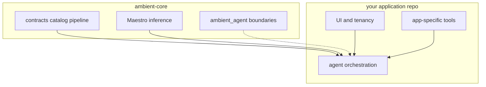

# Agents and agentic workflows

Ambient Core ships **governed data**, **Maestro inference**, and a small **`ambient_agent`** extension point. It does **not** ship tenant-specific copilots, UI workflows, or production secrets handling—that belongs in your application repository.

## Three layers (do not merge them)

**1. Governed data (contracts + catalog + pipeline)**  
Agents should read **published** Gold shapes and reference catalog definitions, not re-derive KPI logic in prompts. Use contract loaders and catalog manifests from this repo.

**2. Maestro (`ambient_inference`, HTTP service)**  
Headless **model routing**, registry, and **council** orchestration. Call Maestro over HTTP (OpenAI-compatible surface) or embed the library in a worker process. Run artifacts align with `maestro-run-v1`. See [inference-layer.md](inference-layer.md).

**3. Application agents (downstream repos)**  
Product-specific agents: org context, Firestore/session state, billing, human-in-the-loop UI, tool wiring to **your** OLTP and OLAP deploy. The commercial Ambient platform keeps these in `ambient-systems-platform` (React client, Cloud Functions, Databricks jobs)—not here.

## What `ambient_agent` is for (today)

The `ambient_agent` package is an **intentionally minimal** namespace:

- Shared **types and boundaries** (`AgentRunContext`, `InferenceClient` protocol) so orchestrators in any repo can depend on stable hooks without pulling SaaS code into core.
- Future **neutral** helpers (run policy, audit fields, tool manifest shapes) that are not tied to Firebase, Databricks, or a single UI.

It is **not** a full LangChain-style framework. Maestro already owns **multi-model inference**; do not duplicate council/router logic inside `ambient_agent`.

## When to put code here vs downstream

**Put in ambient-core**

- Changes to **Maestro** behavior, registry YAML, or `maestro-run-v1`.
- **Neutral** agent primitives that any integrator could reuse (no tenant IDs, no vendor SDKs).
- Documentation and contracts that define **cross-product** agent artifacts.

**Put in your application repo**

- Agents that read **tenant** Firestore paths, org roles, or commercial entitlements.
- Tools that trigger **your** deploy pipelines, tickets, or internal APIs.
- Browser-facing flows and API keys for end users.

**Rule of thumb:** if the code needs a **specific customer’s project ID** or **your** secret store layout, it does not belong in core.

## How integrators can use this (open source)

1. Pin a tagged release ([INTEGRATING.md](INTEGRATING.md)).
2. Run Maestro (Docker or `services/maestro`) and call it from a worker or script.
3. Import `ambient_agent.boundaries` when you want shared context types between your orchestrator and Maestro clients.
4. Keep **tool implementations** in your repo; pass only **contract references** and **run IDs** into prompts and logs.

## How the Ambient platform uses it (commercial product)

Today the platform:

- Calls Maestro via [`maestroClient.js`](https://github.com/Ambient-Team/ambient-systems-platform/blob/main/src/services/maestroClient.js) and local [inference compose](https://github.com/Ambient-Team/ambient-systems-platform/blob/main/docker/inference.compose.yaml).
- Does **not** embed a heavy agent runtime in the React app (no LLM keys in the browser).

Tomorrow (optional): Python or Functions workers in the platform repo may orchestrate multi-step flows using **Maestro + `ambient_agent` boundaries**, while tenant state and tools remain platform-only. That code would **not** move into ambient-core unless it becomes product-neutral.

## Why not ship full agentic SaaS in core?

- **Tenancy and compliance** vary per deployment; core stays MIT and vendor-neutral.
- **Secrets and PII** in prompts must be handled in the operator’s environment ([SECURITY.md](../SECURITY.md)).
- **UI and billing** are product surfaces, not foundation libraries.

## Related

- [ECOSYSTEM.md](ECOSYSTEM.md) — components and release flow
- [CANONICAL_SCOPE.md](CANONICAL_SCOPE.md) — exclusive scope
- [inference-layer.md](inference-layer.md) — Maestro operations
