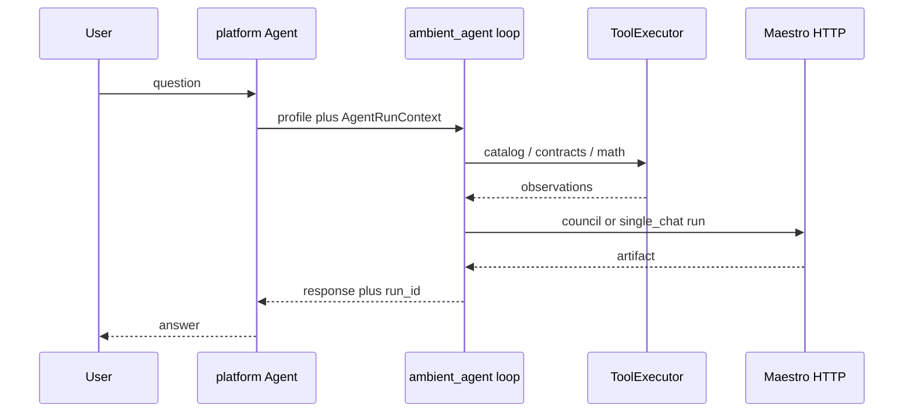

# Agents and agentic workflows

Ambient Core ships **governed data**, **Maestro inference**, and a **plan-execute agent runtime** in `ambient_agent`. Tenant UI, commercial tools, and production secrets belong in your application repository (for example [ambient-systems-platform](https://github.com/Ambient-Team/ambient-systems-platform)).

## End-to-end flow



- **Maestro** owns routing, council, and `POST /v1/runs` — do not reimplement `Router` / `CouncilEngine` in `ambient_agent`.
- **`ambient_agent`** picks a **profile**, runs **core tools** in order, then **one synthesis Maestro run** with observations in the prompt.
- **Your app** supplies tenancy, UI, and optional tools via `register_tool()` at process startup.

## Declarative config (core)

| File | Purpose |
|------|---------|
| [`lib/ambient_agent/tool_definitions.yaml`](../lib/ambient_agent/tool_definitions.yaml) | Core tool ids, parameters, descriptions |
| [`lib/ambient_agent/agent_profiles.yaml`](../lib/ambient_agent/agent_profiles.yaml) | Agent types: Maestro mode, `task_type`, ordered `tool_ids` |
| [`lib/ambient_inference/default_config/council_profiles.yaml`](../lib/ambient_inference/default_config/council_profiles.yaml) | Council modes referenced by profile `maestro_mode` |

Validate after edits:

```bash
validate-agent-config
validate-inference-registry
```

## Agent types (profiles)

| Profile id | Maestro mode | Router task (typical) | Core tools | Core vs platform |
|------------|--------------|------------------------|------------|------------------|
| `researcher` | `council_research` | `research_qa` | catalog_*, contracts_list | Core only; platform adds metrics/OLAP tools |
| `analyst` | `single_chat` | `general_chat` | catalog_resolve_metric, structured_json | Platform adds fulfillment / tenant metrics |
| `auditor` | `single_chat` | `general_chat` | contracts_validate, contracts_list | Platform adds policy store / tickets |
| `summarizer` | `council_research` or `single_chat` | configurable | catalog_*, maestro_run (via loop) | Platform adds doc sources |
| `optimizer` | `council_research` | `research_qa` | contracts_list, catalog_* | Platform adds pipeline triggers |

**Not in core YAML:** web search, Firestore writes, Databricks job triggers, `metricFulfillment`, billing — implement in the platform repo and register at runtime.

## Runtime API (Python)

```python
from ambient_agent import run_plan_execute, register_tool, AgentRunContext

register_tool("my_tenant_metric", my_handler)  # platform only

result = run_plan_execute(
    profile_id="auditor",
    user_message="Validate contract X",
    context=AgentRunContext(run_id="...", metadata={"org_id": "..."}),
)
# result.content, result.run_id, result.observations
```

Modules: `tools.py` (built-ins), `registry.py` (`register_tool`), `executor.py`, `maestro_client.py`, `loop.py` (`run_plan_execute`). Direct calls to the `maestro_run` tool id are blocked; synthesis goes through the loop.

**Phase 2 (not in v0.2.3):** ReAct loops with LLM-parsed tool calls require Maestro `CreateRunRequest` tool-calling support.

## Three layers (do not merge them)

**1. Governed data (contracts + catalog + pipeline)**  
Agents read published Gold shapes and catalog definitions via core tools—not ad-hoc KPI logic in prompts.

**2. Maestro (`ambient_inference`, HTTP service)**  
Model routing, registry, council. See [inference-layer.md](inference-layer.md).

**3. Application agents (downstream repos)**  
Org context, session state, human-in-the-loop UI, and **registered** tools for your OLTP/OLAP.

## Platform extensions

In **ambient-systems-platform** (or your fork):

1. Depend on a tagged **ambient-core** release.
2. At worker/API startup, `from ambient_agent import register_tool` and bind Firestore, Databricks, or commercial helpers.
3. Call `run_plan_execute(profile_id=..., ...)` from a Cloud Function, Python worker, or batch job—not from the browser with secrets.

Platform consumer flow: [ambient-systems-platform `docs/ambient-core.md`](https://github.com/Ambient-Team/ambient-systems-platform/blob/main/docs/ambient-core.md). Optional platform note: [`docs/agents.md`](https://github.com/Ambient-Team/ambient-systems-platform/blob/main/docs/agents.md) (agents run in platform; core supplies profiles/tools loop).

## When to put code here vs downstream

**Put in ambient-core**

- Maestro behavior, registry YAML, `maestro-run-v1`.
- Neutral tool definitions and plan-execute loop.
- Cross-product agent artifacts and validation.

**Put in your application repo**

- Tenant paths, entitlements, vendor SDKs.
- Tools that trigger **your** deploy pipelines or internal APIs.
- Browser-facing flows and end-user API keys.

## Integrators (open source)

1. Pin a tagged release ([INTEGRATING.md](INTEGRATING.md)).
2. Run Maestro and set backend env vars ([inference-layer.md](inference-layer.md)).
3. Use `run_plan_execute` or import boundaries (`AgentRunContext`, `InferenceClient` protocol).
4. Register app-specific tools; keep contract references and Maestro **run IDs** in logs.

## Related

- [ECOSYSTEM.md](ECOSYSTEM.md) — components and release flow
- [CANONICAL_SCOPE.md](CANONICAL_SCOPE.md) — exclusive scope
- [inference-layer.md](inference-layer.md) — Maestro operations
- [examples/integrations/openclaw/README.md](../examples/integrations/openclaw/README.md) — external assistant shell pattern
