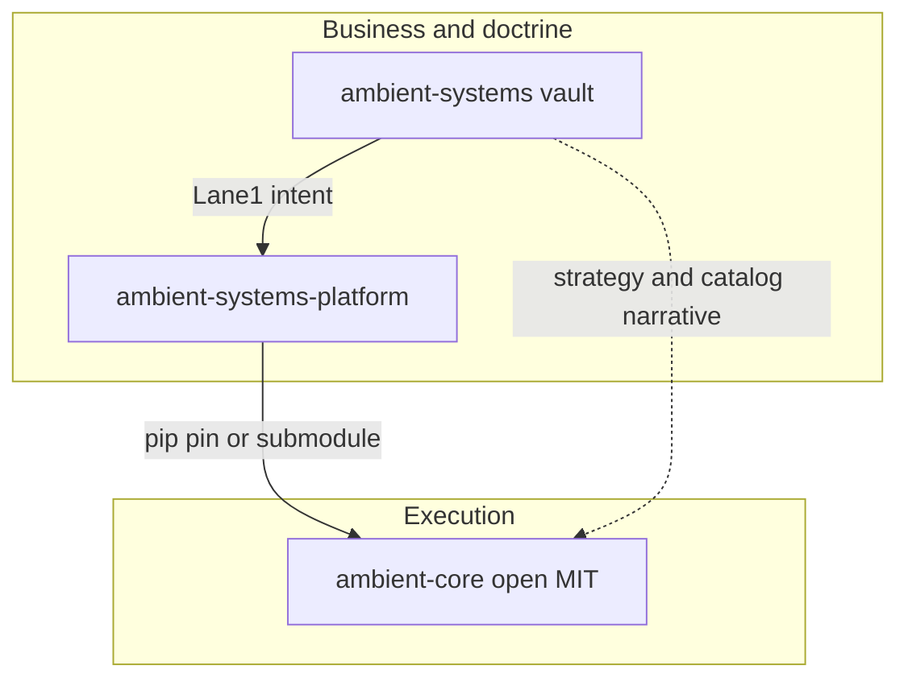
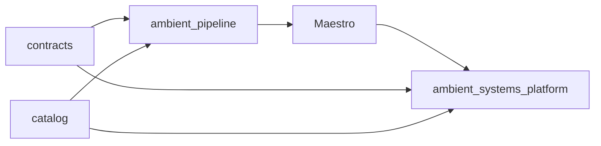
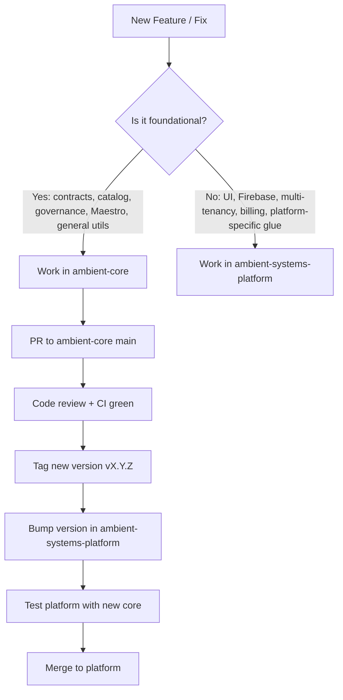

# Ambient Core — Ecosystem

How **ambient-core** relates to the Ambient Systems documentation vault and the production platform. Read this before large contract or catalog changes.

## Business context (public-safe)

Ambient Systems designs a **governed medallion data platform** for **financial planning and analysis (FP&A)** and **operational intelligence** in asset-heavy, regulated industries. Durable outputs are **contract-backed Gold-layer data products** consumed by read-only adapters (for example Firestore sync, Tableau, Power BI)—not a dashboard or asset-management product.

- **Solutions Flux D'IA Inc.** (Quebec) develops and operates the live platform.
- **Ambient Systems Limited** (Hong Kong) is the corporate and IP vehicle.
- **Commercial activity is frozen.** The platform is maintained as a technical moat. Open-source docs here use neutral, factual tone—no sales language or revenue claims.

## Three repositories

**ambient-systems** (private documentation vault)

- URL: https://github.com/Ambient-Team/ambient-systems
- Lane 1 **intent**: strategy, roadmap, human-readable contract catalog, engineering assessments, finance and legal (confidential).
- Not application code. Agent instructions: `AGENTS.md` in that repo.

**ambient-systems-platform** (production SaaS codebase)

- URL: https://github.com/Ambient-Team/ambient-systems-platform
- Lane 2 **execution**: React/Firebase OLTP, Databricks OLAP bundles, jobs, platform CI, deploy bindings.
- **Consumes** this repo via pip (git tag pin) and/or git submodule at `ambient-core/`.
- Architecture: `ARCHITECTURE.md` in that repository.

**ambient-core** (this repository, MIT)

- URL: https://github.com/Ambient-Team/ambient-core
- **Open foundation**: YAML contract SSOT (`contracts/`), reference catalog, governance pipeline primitives, Maestro inference library and service skeleton.
- Reusable without the platform (`pip install` / editable install).

## Purpose and platform connection

**ambient-core** supplies vendor-neutral contracts, catalog semantics, lakehouse governance helpers, and headless AI (Maestro). The commercial platform **[ambient-systems-platform](https://github.com/Ambient-Team/ambient-systems-platform)** installs and pins this repository, then layers React/Firebase OLTP, Databricks OLAP, multi-tenancy, billing, and production deploy. Core is the open foundation; the platform is what operators run end to end.

| Component | Purpose in ambient-core (open) | How it ties into the commercial platform |
|-----------|--------------------------------|------------------------------------------|
| `contracts/` | Single source of truth for all data-product schemas (YAML). Defines what Gold-layer products must look like. | Platform consumes these contracts for validation, lineage, quality scoring, and consumption adapters (Firestore mirror, OLAP, etc.). |
| `catalog/` | Reference catalog of metrics, benchmarks, industries, and data options. | Platform uses generated `manifest.json` and `runtime/` files for UI dropdowns, auto-mapping, validation rules, and KPI templates. |
| `lib/ambient_pipeline/` | Reusable governance primitives (provenance stamping, PII pseudonymization, Silver validation, catalog mapping). | Platform Databricks OLAP jobs and notebooks import and extend these helpers for consistent Bronze → Silver → Gold processing. Shared modules may still overlap with `olap/lib/ambient_pipeline` until deduplication completes. |
| `lib/ambient_inference/` + `services/maestro/` | Open-weight model registry, intelligent router, Maestro council orchestrator, and OpenAI-compatible inference service. | Platform React app and backend call Maestro via HTTP for AI features (research Q&A, agentic workflows, operational insights) without embedding LLMs in the UI tier. |

### Open-source priority (maintainers)

| Priority | Component | Why |
|----------|-----------|-----|
| 1 | `contracts/` | Foundational SSOT |
| 2 | Maestro (`ambient_inference` + service) | Core AI capability |
| 3 | `ambient_pipeline/` | Governance primitives |
| 4 | Catalog system | Very useful; more mature work can follow contracts and Maestro |

### How the pieces fit together

- **Contracts + catalog** define what data and metrics should exist.
- **Pipeline primitives** define how to safely move and validate data (Bronze → Gold).
- **Maestro** provides intelligence on top of governed data (reasoning, drafting, synthesis).
- **The commercial platform** is the full product that uses ambient-core as a dependency (pip + git tag), adds React UI, Firebase integration, Databricks deployment, billing, and related glue, and deploys everything together for end users.

### Where to work (contributors)

After core changes merge, tag a release on `main`, then follow platform pin, submodule, and test steps in [CONTRIBUTING.md — Releases](CONTRIBUTING.md#releases) and [Platform follow-up](CONTRIBUTING.md#platform-follow-up-after-core-merge).

## Responsibilities (what lives where)

**In ambient-core**

- Data-product contract YAML under `contracts/` (single source of truth for open packages).
- Reference catalog YAML, JSON schemas, `ambient-catalog-generate` output under `catalog/`.
- Python packages: `ambient_contracts`, `ambient_pipeline`, `ambient_inference`, `ambient_agent`, `ambient_cli`.
- Headless Maestro HTTP service under `services/maestro/`.
- Open CI: contract validation, catalog check, pytest.

**In ambient-systems-platform**

- User-facing app, Cloud Functions, Firestore rules and schemas.
- Databricks Asset Bundles, OLAP notebooks, lakehouse deploy.
- Platform-specific secrets, external resource allowlist, commercial usage wiring.
- Must **not** mirror `contracts/` or `catalog/` at the platform repo root; use the **`ambient-core/`** submodule at the **same git tag** as the pip pin ([INTEGRATING.md](INTEGRATING.md)).

**In ambient-systems (vault)**

- Master strategy, platform roadmap, operator journey, executive summary (`master/`).
- Internal GTM and career materials (not public).
- Do not paste vault finance or legal content into public issues or PRs on ambient-core.

## Data and release flow

1. **Contracts** — Edit `contracts/*.yaml` here; copy to `lib/ambient_contracts/bundled/` for wheels (CI enforces sync). Platform installs the published or pinned package.
2. **Catalog** — Edit YAML under `catalog/` here; run `ambient-catalog-generate`; consumers import `catalog/runtime/` via submodule at the pinned tag.
3. **Maestro** — Inference logic and `maestro-run-v1` contract ship in `ambient_inference`; platform runs compose/Docker and HTTP clients only at the boundary.
4. **Releases** — Tag `vX.Y.Z` on `main` here; bump the git pin in platform `pyproject.toml` and `docker/maestro.Dockerfile` (see [CONTRIBUTING.md](CONTRIBUTING.md)).

## Who clones which repo

- **Platform operators and full-stack developers** — [ambient-systems-platform](https://github.com/Ambient-Team/ambient-systems-platform) (app, lakehouse, deploy).
- **Contract/catalog/library authors and OSS integrators** — **ambient-core** (this repo).
- **Strategy, roadmap, confidential finance/legal** — private [ambient-systems](https://github.com/Ambient-Team/ambient-systems) vault.

## Platform integration

1. Pin **`ambient-core`** in platform `pyproject.toml` to a git tag (`ambient-core[…] @ git+…@vX.Y.Z`).
2. Optionally track the same release via **`ambient-core/` git submodule** for catalog `runtime/` and checkout paths.
3. Regenerate or verify catalog with **`ambient-catalog-generate --check`** on the submodule when the app imports JS from it.
4. Follow [CONTRIBUTING.md](CONTRIBUTING.md) **Platform follow-up** after each core release.

## How to consume latest changes

**If you only use ambient-core (fork / library):**

- Pull `main` or install a **git tag**: `pip install "ambient-core[…] @ git+…@vX.Y.Z"`.
- Run `validate-contracts` and `ambient-catalog-generate --check` after upgrading.

**If you work on ambient-systems-platform:**

- After a core release, **bump the pip pin** in `pyproject.toml` (and Docker Maestro pin if applicable).
- **Advance the `ambient-core/` submodule** when the app or notebooks need fresh `catalog/runtime/` or checkout paths.
- **Merge overlapping `ambient_pipeline` files** when governance modules changed in core.
- Full checklist: [CONTRIBUTING.md](CONTRIBUTING.md) (Platform follow-up).

## Consumption paths

- **Platform operators** — Use the deployed SaaS and lakehouse; contracts and catalog semantics originate in ambient-core.
- **Integrators and forks** — `pip install -e ".[all]"` (or subset extras) without cloning the platform repo.
- **Documentation readers** — Vault `master/05_executive-summary.md` (private clone) for medallion and governance narrative; platform `docs/` for layer manuals.

## Sensitivity

The vault repository is **private** and may contain confidential finance and legal material. Keep public ambient-core discussions limited to open artifacts in this tree.

## Future workflow

A documented sync from ambient-core into the commercial/documentation vault (for example updating human contract catalogs when YAML SSOT moves) is planned separately; not implemented in this repository yet.

## Related docs in this repo

- [USAGE.md](USAGE.md) — use ambient-core without the platform
- [INTEGRATING.md](INTEGRATING.md) — pin and import a tagged release
- [CORE_VS_PLATFORM.md](CORE_VS_PLATFORM.md) — responsibility split
- [ARCHITECTURE.md](ARCHITECTURE.md) — packages and layer boundary
- [CONTRIBUTING.md](CONTRIBUTING.md) — development, releases, platform follow-up
- [inference-layer.md](inference-layer.md) — Maestro layer manual
