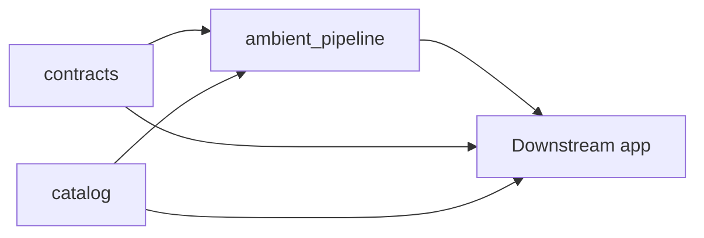
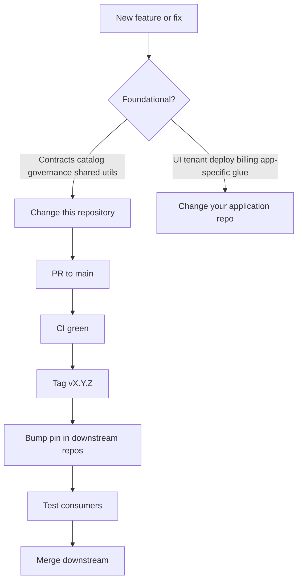

# Ambient Core — Ecosystem

What this repository contains and how releases flow. **New visitors:** start with the [README](../README.md) and [docs/README.md](README.md).

## What this repo is

A **governed medallion data foundation** for financial planning and analysis (FP&A) and operational intelligence in asset-heavy, regulated industries. Durable outputs are **contract-backed Gold-layer data products** consumed by read-only adapters (for example BI tools, operational stores, sharing endpoints)—not a turnkey dashboard product, and not a customer-facing AI product.

This tree is **canonical for everyone**: contracts, reference catalog, and shared pipeline governance. Application UIs, tenant deploy, and operator-specific glue live in **separate repositories** that pin a tagged release of this project (see [INTEGRATING.md](INTEGRATING.md)).

## Components in this repository

**Contracts** ([contracts/README.md](../contracts/README.md)) — versioned YAML for data-product shapes, lineage, and quality semantics.

**Catalog** (`catalog/`) — reference metrics, industries, benchmarks; `ambient-catalog-generate` produces `manifest.json` and `runtime/` JS.

**Pipeline governance** (`lib/ambient_pipeline/`) — vendor-neutral helpers: Silver validation, provenance, PII pseudonymization, catalog mapping, bronze helpers.

Integrator guides for governed data and pipeline helpers: [governed-data.md](governed-data.md), [work-cycles.md](work-cycles.md), [benchmarking-lifecycle.md](benchmarking-lifecycle.md), [pipeline.md](pipeline.md), [CONVENTIONS.md](CONVENTIONS.md) (naming, formats, storage).

**Packaging** — `ambient_contracts`, `ambient_cli`, `ambient_calc`, `ambient_pipeline`, CLIs, tests, and CI.

### Maintainer priorities

1. **`contracts/`** — foundational single source of truth.
2. **`ambient_pipeline/`** — governance primitives.
3. **`catalog/`** — reference data (mature; follows contracts when capacity is tight).

### How the pieces fit together

- **Contracts + catalog** define what data and metrics should exist.
- **Pipeline primitives** define how to move and validate data safely (Bronze → Gold).
- **Downstream applications** import this repo (pip and/or submodule), then add UI, OLTP/OLAP deploy, multi-tenancy, and operator tooling in their own trees.

### How consumers typically use each component

- **`contracts/`** — provided here as Gold/data-product YAML SSOT; downstream use for validation, lineage, quality scoring, adapter shapes
- **`catalog/`** — reference KPIs and industries; UI templates, auto-mapping, `manifest.json` in notebooks
- **`lib/ambient_pipeline/`** — shared governance modules for lakehouse jobs; app-specific glue stays in the consumer repo

Details: [CANONICAL_SCOPE.md](CANONICAL_SCOPE.md), [CORE_VS_PLATFORM.md](CORE_VS_PLATFORM.md) (foundation vs full product).

## Where to make changes

After merge here, tag on `main`, then follow [CONTRIBUTING.md — Consumer follow-up](CONTRIBUTING.md#consumer-follow-up-after-a-release).

## Product AI boundary

Ambient Core does not ship inference, model registry, council workflows, or customer agent runtimes. Internal operator AI (Cursor Agent / IDE) is not an Ambient Core deliverable. Future patented proprietary AI/ML, if any, belongs only in the commercial platform application — not in this MIT core, and not as resale of third-party models.
