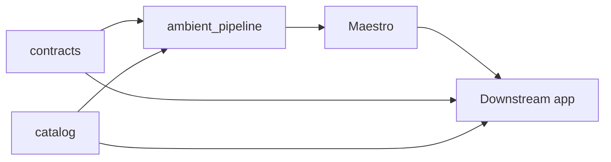
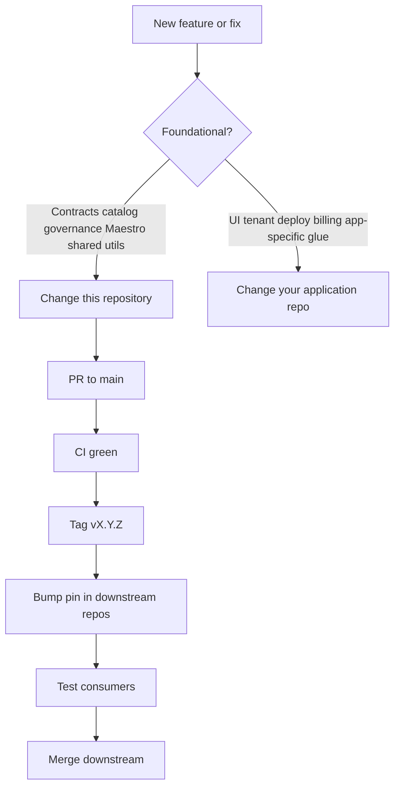

# Ambient Core — Ecosystem

What this repository contains and how releases flow. **New visitors:** start with the [README](../README.md) and [docs/README.md](README.md).

## What this repo is

A **governed medallion data foundation** for financial planning and analysis (FP&A) and operational intelligence in asset-heavy, regulated industries. Durable outputs are **contract-backed Gold-layer data products** consumed by read-only adapters (for example BI tools, operational stores, sharing endpoints)—not a turnkey dashboard product.

This tree is **canonical for everyone**: contracts, reference catalog, shared pipeline governance, and Maestro inference. Application UIs, tenant deploy, and operator-specific glue live in **separate repositories** that pin a tagged release of this project (see [INTEGRATING.md](INTEGRATING.md)).

## Components in this repository

**Contracts** ([contracts/README.md](../contracts/README.md)) — versioned YAML for data-product shapes, lineage, and quality semantics.

**Catalog** (`catalog/`) — reference metrics, industries, benchmarks; `ambient-catalog-generate` produces `manifest.json` and `runtime/` JS.

**Pipeline governance** (`lib/ambient_pipeline/`) — vendor-neutral helpers: Silver validation, provenance, PII pseudonymization, catalog mapping, bronze helpers.

**Maestro** (`lib/ambient_inference/`, `services/maestro/`) — model registry, router, council orchestration, OpenAI-compatible HTTP API; run artifact contract `maestro-run-v1`.

**Agents** (`lib/ambient_agent/`) — neutral extension point and boundaries for orchestrators; product agents stay downstream. See [AGENTS.md](AGENTS.md) and [agent-security.md](agent-security.md).

Integrator guides for governed data and pipeline helpers: [governed-data.md](governed-data.md), [work-cycles.md](work-cycles.md), [benchmarking-lifecycle.md](benchmarking-lifecycle.md), [pipeline.md](pipeline.md), [CONVENTIONS.md](CONVENTIONS.md) (naming, formats, storage).

**Packaging** — `ambient_contracts`, `ambient_cli`, `ambient_agent`, CLIs, tests, and CI.

### Maintainer priorities

1. **`contracts/`** — foundational single source of truth.
2. **Maestro** — headless inference and routing.
3. **`ambient_pipeline/`** — governance primitives.
4. **`catalog/`** — reference data (mature; follows contracts and Maestro when capacity is tight).

### How the pieces fit together

- **Contracts + catalog** define what data and metrics should exist.
- **Pipeline primitives** define how to move and validate data safely (Bronze → Gold).
- **Maestro** adds reasoning, drafting, and synthesis on top of governed data.
- **Downstream applications** import this repo (pip and/or submodule), then add UI, OLTP/OLAP deploy, multi-tenancy, and operator tooling in their own trees.

### How consumers typically use each component

- **`contracts/`** — provided here as Gold/data-product YAML SSOT; downstream use for validation, lineage, quality scoring, adapter shapes
- **`catalog/`** — reference KPIs and industries; UI templates, auto-mapping, `manifest.json` in notebooks
- **`lib/ambient_pipeline/`** — shared governance modules for lakehouse jobs; app-specific glue stays in the consumer repo
- **Maestro** — HTTP inference service + library; call over HTTP; do not fork orchestration into the UI tier

Details: [CANONICAL_SCOPE.md](CANONICAL_SCOPE.md), [CORE_VS_PLATFORM.md](CORE_VS_PLATFORM.md) (foundation vs full product).

## Where to make changes

After merge here, tag on `main`, then follow [CONTRIBUTING.md — Consumer follow-up](CONTRIBUTING.md#consumer-follow-up-after-a-release).

## Release and data flow

1. **Contracts** — Edit `contracts/*.yaml`; sync `lib/ambient_contracts/bundled/` (CI enforces).
2. **Catalog** — Edit YAML under `catalog/`; run `harden_catalog_data_options.py --write` when changing data options; run `ambient-catalog-generate --check --strict-data-option-inputs` before push.
3. **Maestro** — Logic and `maestro-run-v1` ship in `ambient_inference`; consumers run HTTP clients or compose at deploy time.
4. **Releases** — Tag `vX.Y.Z` on `main`; consumers bump pip/submodule/Docker pins per [INTEGRATING.md](INTEGRATING.md).

## Who works in this repo

- **Library and contract authors** — integrators, forks, and anyone shipping governed data products.
- **Application teams** — depend on a tag; do not mirror `contracts/` or `catalog/` for editing (submodule or env paths only).

## Related docs

- [docs/README.md](README.md) — documentation index
- [CANONICAL_SCOPE.md](CANONICAL_SCOPE.md) — exclusive scope
- [INTEGRATING.md](INTEGRATING.md) — pin and import a release
- [USAGE.md](USAGE.md) — quick start from a clone
- [CORE_VS_PLATFORM.md](CORE_VS_PLATFORM.md) — foundation vs full product (generic)
- [ARCHITECTURE.md](ARCHITECTURE.md) — packages and trees
- [CONTRIBUTING.md](CONTRIBUTING.md) — development and releases
- [inference-layer.md](inference-layer.md) — Maestro manual
- [AGENTS.md](AGENTS.md) — agentic workflow boundaries
