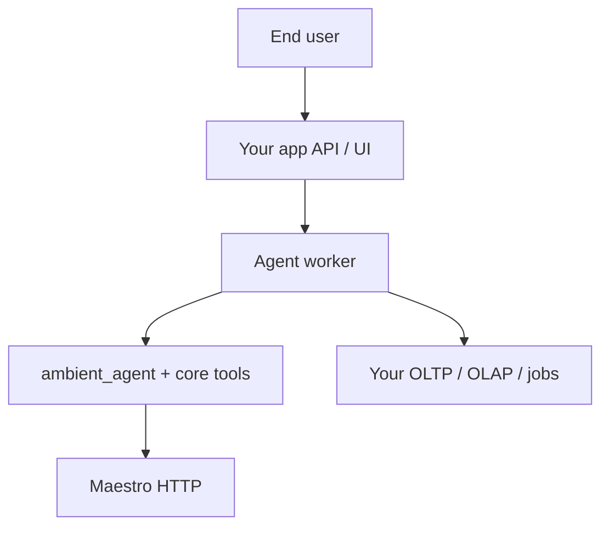

# Agent security (open source integrators)

`ambient_agent` is a **thin plan-execute runtime**: fixed profile tools, read-only governed metadata, one Maestro synthesis call. It does **not** provide end-user authentication, tenant isolation, or secrets management. Production hardening belongs in your **worker**, **Maestro deployment**, and **platform** code — see [CORE_VS_PLATFORM.md](CORE_VS_PLATFORM.md) and [SECURITY.md](../SECURITY.md).

Runtime overview: [AGENTS.md](AGENTS.md). Governed data consumption: [governed-data.md](governed-data.md).

## Trust boundaries

- **`ambient_agent`** — core: profile tool order; block direct `maestro_run` via `execute()`. Your app: who may call `run_plan_execute`; rate limits.
- **Core tools** — core: read catalog manifest and contract YAML from resolved paths. Your app: `AMBIENT_*` paths; no cross-tenant path injection in APIs.
- **`register_tool()`** — core: process-global handler map. Your app: per-tenant authZ before invoking tools; safe args.
- **Maestro** — core: optional API key on service. Your app: network policy, keys, model allowlists — [inference-layer.md](inference-layer.md).

`AgentRunContext.metadata` (for example `org_id`) is forwarded to Maestro as metadata — it is **not** verified by core.

## Threats to plan for

**Prompt injection** — `user_message` and tool observation JSON are embedded in the synthesis prompt. A user can try to override instructions or exfiltrate context. Mitigate with app-layer auth, output filtering, and least-privilege tools (do not register broad SQL or admin tools without checks).

**Tool argument abuse** — `run_plan_execute` supplies default args from `user_message` for some tools (for example `catalog_resolve_metric`). Direct `execute(tool_id, args, ...)` with caller-controlled `args` is more dangerous. Validate args in your worker; wrap handlers with auditing.

**Global registry** — `register_tool()` is one namespace per process. Multi-tenant workers must not register per-request handlers without a reload strategy; prefer a single handler that reads tenant scope from `AgentRunContext` after **your** authZ.

**Maestro exposure** — If `AMBIENT_MAESTRO_API_KEY` is unset, a misconfigured Maestro instance may accept unauthenticated runs. Always protect Maestro in production.

**Path traversal (contracts)** — Core `contracts_validate` accepts **basename only** for `contract_file`. Apply the same rule in any custom API that loads contracts by name.

## Hardening checklist (application repo)

- [ ] Run agents only in a **backend worker** — never ship Maestro or vendor keys to the browser.
- [ ] Enable Maestro API key (or equivalent gateway auth) and restrict network access.
- [ ] Authenticate the user/session before calling `run_plan_execute`; map identity to `org_id` in metadata intentionally.
- [ ] Register tenant-scoped tools that enforce entitlements inside the handler.
- [ ] Log `run_id` and Maestro run ids for audit; avoid logging full prompts if they contain PII.
- [ ] Run `validate-agent-config` in CI when you fork profiles or tools.
- [ ] Pin `ambient-core` tags and validate contracts/catalog on upgrade — [INTEGRATING.md](INTEGRATING.md).

## What core does not enforce (today)

- Full JSON Schema validation of tool arguments (builtins get required fields and simple types via `execute()` — see [lib/ambient_agent/arg_validate.py](../lib/ambient_agent/arg_validate.py); **registered** tools are not validated in core)
- `max_tool_rounds` in profiles (single pass over `tool_ids` only)
- Per-tenant tool registry
- Authorization or tool allowlisting from `contract_refs` / `catalog_refs` (core only adds them as **hints** in the synthesis prompt)
- Timeouts on individual tool handlers (Maestro HTTP client uses a fixed timeout)

These may be added in core later; until then, implement wrappers in the platform worker.

## Related patterns

- [examples/integrations/openclaw/README.md](../examples/integrations/openclaw/README.md) — external assistant shell without embedding secrets in core
- [governed-data.md](governed-data.md) — catalog and contracts for agents vs pipelines
