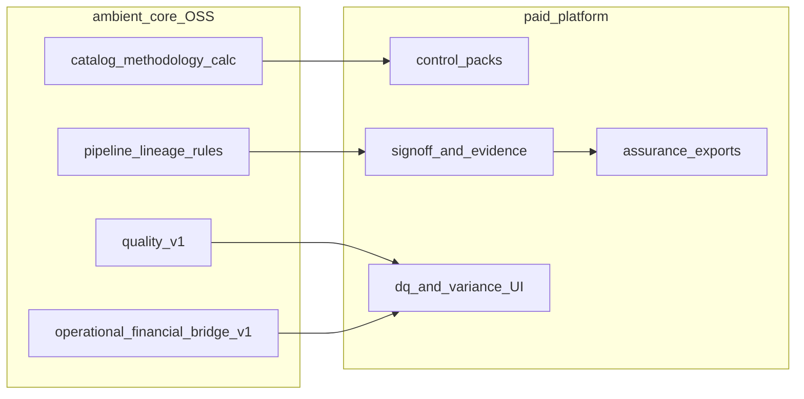

# Assurance lifecycle: core vs platform

**Assurance** is the work cycle that asks whether a metric can be **defended**: correct under a fixed definition, supported by evidence, traceable through lineage, and aligned between operational signals and financial outcomes. It is distinct from [benchmarking](benchmarking-lifecycle.md) (who is better than whom) and from [investor disclosure](investor-disclosure-lifecycle.md) (whether mandates for capital access are met)—though disclosed and benchmarked numbers should ideally pass the same assurance bar.

ambient-core defines **what** is measured and **how** Gold products are shaped; a **paid platform** runs control workflows, sign-off, and attestation packaging.

Index of all cycles: [work-cycles.md](work-cycles.md).

## End-to-end flow

## Phase mapping

### 1. Control scope and definitions

- **Core** — Catalog `methodology`, `industry.segment.slug` keys, and [CONVENTIONS.md](CONVENTIONS.md); contract schemas that define required columns and consumption rules.
- **Platform** — Control objectives per org and lens; mapping catalog metrics and contracts to control assertions; `assurance_framework` or `control_pack_id` in run metadata.

### 2. Evidence and ingestion

- **Core** — Bronze lineage enforcement (`enforce_bronze_lineage`), [catalog input field policy](../catalog/input_field_policy.yaml), PHI denylist; plain-text extract boundary per [governed-data.md](governed-data.md).
- **Platform** — Upload approvals, immutable evidence store, who certified which period, restatement policy.

### 3. Data quality measurement

- **Core** — [quality-v1.yaml](../contracts/quality-v1.yaml) shape: completeness, accuracy, anomaly counts, overall score, BCBS 239–oriented lineage fields on the governed scorecard and pipeline audit products.
- **Platform** — DQ dashboards, thresholds, escalation when grades fall below policy.

### 4. Operational–financial reconciliation

- **Core** — [operational-financial-bridge-v1.yaml](../contracts/operational-financial-bridge-v1.yaml) (alignment flag, variance counts, bridge mapping records); [bridge_rules.yaml](../catalog/bridge_rules.yaml) and `metricBridgeHints.js` for narrative links between operational names and financial metrics (energy, NOI, DSCR themes).
- **Platform** — Reconciliation UI, ticketed variances, covenant “watermelon KPI” guards described in contract consumption notes.

### 5. Attestation and audit trail

- **Core** — [observability-pipeline-v1.yaml](../contracts/observability-pipeline-v1.yaml) audit and performance event shapes; Maestro run artifacts and JSONL run-complete lines for inference audit.
- **Platform** — Assurance packs for external reviewers, read-only auditor portals, period close sign-off matrices.

## What core will not do

- Issue audit opinions or SOC reports.
- Replace GRC, SOX, or IT general-control tools.
- Store control testing workflows or sample selections.

The **`auditor` agent profile** in [AGENTS.md](AGENTS.md) validates contract YAML and summarizes governance observations in a plan-execute run—it is **not** the assurance product described here.

## REIT illustration (alignment, not ranking)

For a real-estate or listed REIT org, assurance often requires showing that **energy and property operations** tie to **financial outcomes**: energy consumption data options in [real_estate.yaml](../catalog/industries/real_estate.yaml), NOI and cap-rate semantics in the same pack, and bridge hints for energy versus opex and NOI. Assurance succeeds when operational extracts and financial close reconcile under one definition—not when the REIT beats a peer on NOI margin ([benchmarking-lifecycle.md](benchmarking-lifecycle.md)).

## Related

- [work-cycles.md](work-cycles.md)
- [benchmarking-lifecycle.md](benchmarking-lifecycle.md)
- [investor-disclosure-lifecycle.md](investor-disclosure-lifecycle.md)
- [agent-security.md](agent-security.md)
- [pipeline.md](pipeline.md)
- [quality-v1.yaml](../contracts/quality-v1.yaml)
