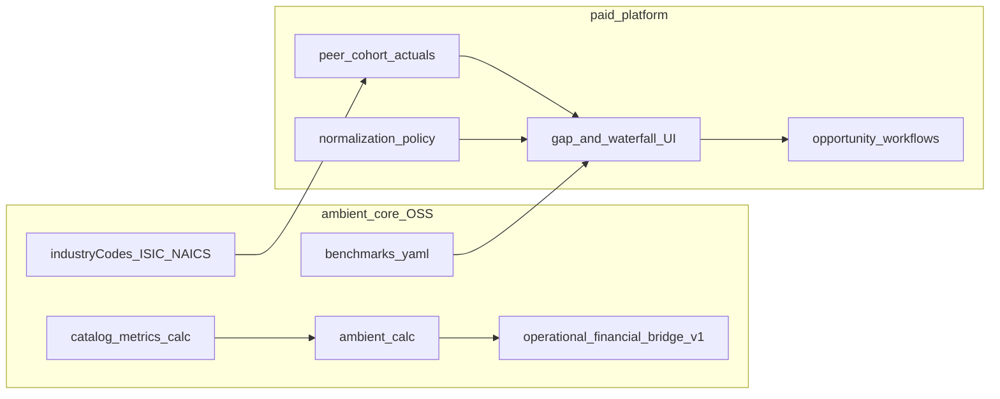

# Benchmarking lifecycle: core vs platform

Ambient Core is designed to support **benchmarking-style** FP&A and operational intelligence: fixed KPI definitions, peer-appropriate metrics within an [analysis lens](governed-data.md#analysis-lens-and-multi-org-tenancy), and guardrail bands—not the full commercial loop from peer comparison through gap decomposition to managed improvement. That second half lives in a **paid multi-tenant platform** (for example [ambient-systems-platform](https://github.com/Ambient-Team/ambient-systems-platform)) on top of governed Gold data.

Practitioner benchmarking separates two phases that must not be conflated: a **performance-comparison** phase (levels, gaps, pace-setters) and a **practice-improvement** phase (what to change, whether it is transferable, and how to sustain gains). Core ships the measurement vocabulary and contracts; the platform ships population comparison, normalization policy, structural-vs-improvable decomposition, and action workflows.

## End-to-end flow

## Phase mapping

### 1. Scope and comparability

- **Core** — Industry packs in [catalog/packs.yaml](../catalog/packs.yaml); [analysis lens terminology](../catalog/README.md#terminology); official **ISIC / NAICS / NACE / GICS** tags on each pack (`industryCodes` in `pack.yaml`, exported in manifest v3). Coverage gaps: [catalog-industry-coverage.md](catalog-industry-coverage.md).
- **Platform** — `peer_group_id` and org matching rules (sector, size band, geography, capital structure); optional `reporting_group_id` for holding-company rollup UI only. See recommended metadata in [catalog-consumption.md](catalog-consumption.md#analysis-lens-and-metric-filtering).

### 2. Metric selection

- **Core** — Metrics carry `type` (Financial / Operational), `segment`, and `fpaWorkflow`; operating drivers sit beside `*.core.*` close metrics in each pack (for example Real Estate NOI and cap rate in [real_estate.yaml](../catalog/industries/real_estate.yaml); listed REIT investor metrics under `financial_services.reits.*` in [financial_services.yaml](../catalog/industries/financial_services.yaml)).
- **Platform** — Curated benchmark packs per tenant org; effectiveness versus efficiency groupings in the product UI.

### 3. Operational definitions

- **Core** — `methodology`, stable keys `industry.segment.slug`, and machine-readable `calc` blocks (`expr` + `inputs`) or `input: true` per [CONVENTIONS.md](CONVENTIONS.md). [lib/ambient_calc](../lib/ambient_calc/__init__.py) evaluates declared formulas deterministically; core does not run ad-hoc peer comparison math.
- **Platform** — Upload mapping enforcement, harmonized recomputation when filers use different FFO or NOI boundaries, versioned study or disclosure files.

### 4. Normalization

- **Core** — Intensity-style metrics where authored (per available seat-km, per megawatt, per share, per ton-mile). Normalization **policy** (FX, mix indices, unlevered views) is not computed in this repository.
- **Platform** — Applies normalization before gaps are asserted; frontier methods such as DEA for large peer sets are platform analytics, not OSS.

### 5. Gap analysis (pace-setter vs focal)

- **Core** — Per-vertical `catalog/industries/<pack>/benchmarks.yaml` supplies **healthy bands** linked via `benchmarkKey` on metrics (guardrails for planning, not peer rankings). Sector profiles indicate which metrics typify a business model for comparison design.
- **Platform** — Stores peer actuals, computes gap versus pace-setter, ranked displays, optional composite scores with declared weights and sensitivity analysis.

### 6. Decomposition: improvable vs structural

This is the main **paid** insight after benchmarking: users need to see which parts of a gap they can influence versus which reflect structure they should not misread as poor management.

**Core enablers (not the product):**

- **`calc.inputs` and metric dependencies** — Show which levers are mathematically part of a KPI (numerator, denominator, and upstream metrics resolved by `ambient_calc`). The platform can walk this graph when building bridges; core does not label slices “structural” or “improvable.”
- **[operational-financial-bridge-v1.yaml](../contracts/operational-financial-bridge-v1.yaml)** — Governed alignment between operational telemetry and financial metrics (variance counts, bridge mapping records). This guards “watermelon KPIs”; it is not a full waterfall chart product.
- **[bridge_rules.yaml](../catalog/bridge_rules.yaml)** and generated `metricBridgeHints.js` — Narrative hints linking operational names to financial outcomes.

**Platform (paid):**

- Bridge or waterfall charts that split a headline gap into **structural** slices (documented portfolio mix, geography, asset age, climate, one-offs) and an **improvable** residual tied to operating or financing discipline.
- Linking improvable residuals to actions, owners, and monitoring.

### 7. Improvement and practice transfer

- **Core** — `fpaWorkflow` strings on catalog metrics guide where improvement effort maps.
- **Platform** — Post-benchmark improvement plans, ROI estimates, workflows, ticketing, and sustainment—commercial product scope.

## How the platform should use catalog mechanics

When showing “what is improvable,” the platform should:

1. Resolve the focal metric’s `calc` block and dependency chain from the manifest or YAML.
2. Compare focal and pace-setter values **per input or sub-metric** where data exists, using the same operational definitions.
3. Attribute remaining gap to **documented structural factors** stored in platform metadata (not invented in core).
4. Surface `fpaWorkflow` and bridge hints for interpretation when recommendations are generated.

Core will **not** store peer time series, draw waterfall UI, or classify gap slices without platform logic.

## Illustrative REIT paired comparison (sketch)

This sketch mirrors a rigorous paired benchmark design (comparability screen, fixed definitions, normalization, gap, decomposition). **Empirical figures and primary sources belong in external research materials**; ambient-core supplies the metric definitions and methodology strings below.

**Setup.** Two comparable listed data-centre REITs in the same market and disclosure regime, compared under a Real Estate / REIT investor lens. Each is a **tenant org** on the platform with the same `peer_group_id`, not a single legal entity picker.

**Definitions (core).**

- Occupancy — portfolio rate with a fixed numerator/denominator boundary in upload mapping (platform enforces parity across filers).
- NOI margin — aligns with Real Estate pack semantics (net operating income relative to revenue); see Real Estate NOI methodology in the catalog.
- Investor metrics — `financial_services.reits.funds_from_operations`, `financial_services.reits.ffo_payout_ratio`, `financial_services.reits.same_store_noi_growth` where the org is modeled on the REIT investor segment.
- Leverage and coverage — use `*.core.*` and REIT-appropriate financial metrics; platform reads disclosed gearing and interest coverage under harmonized definitions.

**Normalization (platform).** Common currency for cross-listing comparisons; per-megawatt energy intensity when MW and cost lines are harmonized; mix index for colocation versus hyperscale weighting.

**Gap (platform).** Pace-setter identified per metric; absolute and percentage gaps computed after normalization.

**Decomposition (platform).** Example narrative for a large NOI margin gap: portion attributed to **structural** portfolio mix or non-comparable cost boundaries; residual attributed to **improvable** operating discipline (for example power usage effectiveness and procurement) where operational inputs exist. A distribution-per-unit gap may be decomposed through occupancy and same-store NOI, operating cost intensity, and financing structure—each sub-metric tied to catalog keys or declared inputs.

**Improvement (platform).** Improvable slices become opportunities with confidence scores; practices are assessed for fit before transfer, consistent with theory-aware benchmarking (visible results depend on underlying systems, not copy-paste KPIs).

## Future use cases (same lifecycle)

- Widen REIT compare to a **peer set** with frontier efficiency methods at platform scale.
- Insurance LOB segments (`property_casualty`, `life`, …) with official industry codes and peer cohorts per org lens.
- Aviation network carriers on CASM, RASM, and load factor versus `aviation_network_carrier` profile peers.
- Multimodal transportation orgs on `road_freight` versus `maritime_shipping` profiles without mixing modal definitions.

Optional future core enhancements (not required for the lifecycle doc): export calc dependency graphs in `manifest.json`; a neutral `benchmark-gap-v1` contract if gap tables should be governed in git.

## Related

- [work-cycles.md](work-cycles.md) — hub for benchmarking, assurance, and disclosure cycles
- [governed-data.md](governed-data.md) — catalog vs contracts; analysis lens and tenancy
- [catalog-consumption.md](catalog-consumption.md) — manifest, segment filtering, metadata conventions
- [CORE_VS_PLATFORM.md](CORE_VS_PLATFORM.md) — what is not in OSS
- [crosswalk.md](crosswalk.md) — metric to Gold product links
- [AGENTS.md](AGENTS.md) — one analysis lens per agent run
- [catalog/README.md](../catalog/README.md) — benchmarks.yaml and terminology
