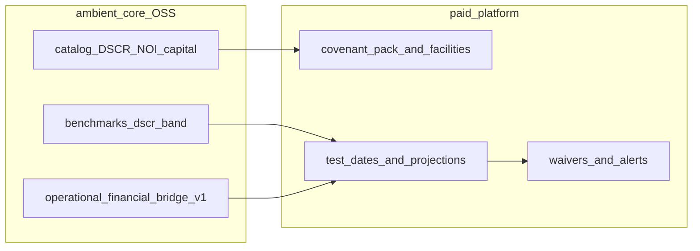

# Covenant monitoring lifecycle: core vs platform

**Covenant monitoring** asks whether a tenant organization stays within **contractual or policy thresholds** set by lenders, bondholders, or internal treasury rules—and which governed metrics drive headroom (DSCR, LTV, coverage, capital ratios). The comparison baseline is the **covenant definition**, not a peer pace-setter ([benchmarking-lifecycle.md](benchmarking-lifecycle.md)) or an exchange mandate ([investor-disclosure-lifecycle.md](investor-disclosure-lifecycle.md)).

Covenant tests should use numbers that pass the [assurance](assurance-lifecycle.md) bar; this cycle adds **threshold logic and alerting** on top.

Index: [work-cycles.md](work-cycles.md).

## End-to-end flow

## Phase mapping

### 1. Covenant scope and metric mapping

- **Core** — Catalog methodologies for covenant-adjacent metrics: Real Estate NOI, cap rate, DSCR in [real_estate.yaml](../catalog/industries/real_estate.yaml); Banking `banking.depository.tier1_capital_ratio` and liquidity via `banking.core.*` / shared close metrics; insurance and other lenses where coverage ratios exist in pack YAML.
- **Platform** — `covenant_pack_id` or `facility_id` mapping legal covenant text to catalog metric ids and test frequency; internal vs external lender views.

### 2. Thresholds versus guardrails

- **Core** — [benchmarks.yaml](../catalog/core/benchmarks.yaml) includes reference bands (for example DSCR lender norm ≥ 1.25x) as **planning guardrails**, not executable covenant law.
- **Platform** — Facility-specific floors, cushions, baskets, and cure periods; forward-looking covenant projections.

### 3. Drivers and bridges

- **Core** — [operational-financial-bridge-v1.yaml](../contracts/operational-financial-bridge-v1.yaml) and [bridge_rules.yaml](../catalog/core/bridge_rules.yaml) link operational signals (energy, NOI drivers) to financial metrics that feed DSCR and coverage numerators and denominators.
- **Platform** — Waterfalls from ops variance to covenant headroom; scenario shocks (rates, occupancy).

### 4. Monitoring and response

- **Core** — Gold shapes for org KPIs and bridge status consumed by platform jobs; no covenant event store in OSS.
- **Platform** — Alerts, waiver workflows, board/lender reporting packs, audit trail of tests run.

## What core will not do

- Store loan agreements or parse covenant legal text.
- Send breach notices or manage waivers.

Regulatory **capital adequacy filing** cycles overlap Banking metrics but follow supervisory templates—a distinct future work cycle noted on [work-cycles.md](work-cycles.md).

## Examples

- **Commercial real estate org (Real Estate lens):** NOI and DSCR versus loan agreement minimum; energy opex bridge explains quarterly headroom change.
- **Depository org (Banking lens):** Tier 1 ratio and liquidity metrics versus internal policy thresholds tied to catalog definitions—not versus another bank’s benchmark rank.

## Related

- [work-cycles.md](work-cycles.md)
- [planning-variance-lifecycle.md](planning-variance-lifecycle.md)
- [benchmarking-lifecycle.md](benchmarking-lifecycle.md)
- [assurance-lifecycle.md](assurance-lifecycle.md)
- [governed-data.md](governed-data.md)
