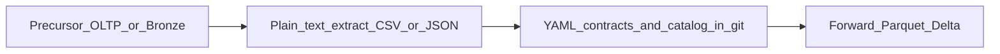
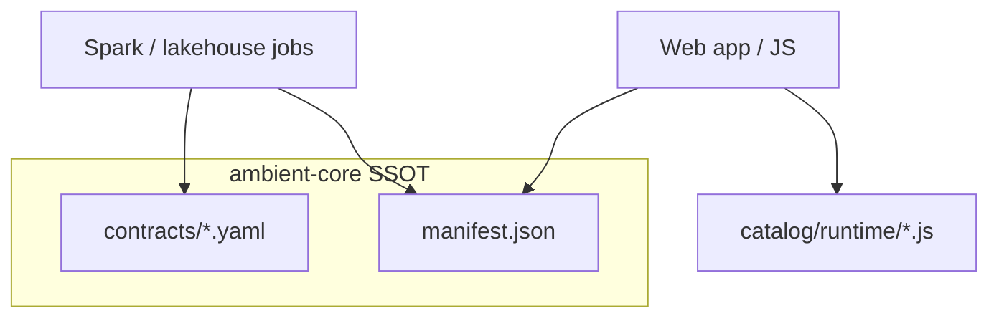

# Governed data: catalog and contracts

This guide answers how **catalog** and **contracts** are used in practice and how to build on top of them without duplicating SSOT in your application repository.

Naming, integer ids, serialization formats, and where databases sit relative to git are defined in [CONVENTIONS.md](CONVENTIONS.md). This page focuses on consumption and the end-to-end data flow.

For catalog YAML authoring, see [catalog/README.md](../catalog/README.md). For contract file layout in this repo, see [contracts/README.md](../contracts/README.md).

## Plain text SSOT and data flow

Ambient Core owns the **middle** layer: human-authored **YAML** for contracts and catalog semantics, and machine-generated **JSON** (`catalog/manifest.json`, JSON Schemas, bronze mapping payloads) and **JavaScript** (`catalog/runtime/*.js` from `ambient-catalog-generate`). Do not maintain a second editable copy of those trees in a consumer repo — pin a tagged checkout or submodule ([INTEGRATING.md](INTEGRATING.md), [CANONICAL_SCOPE.md](CANONICAL_SCOPE.md)).

Operational databases and lakehouse Bronze are **precursors**: data is extracted to plain text (typically **CSV/TSV** or **JSON**) at the upload boundary before governance runs. Silver → Gold and similar **forward** stores are Parquet/Delta or service SQL in deployment; their shapes are still defined by YAML in `contracts/`. Details: [CONVENTIONS.md — Data formats and storage](CONVENTIONS.md#data-formats-and-storage).



Medallion job steps that implement this path are in [pipeline.md](pipeline.md).

## Two layers

- **Catalog** — reference KPIs, industries, data-source templates, benchmarks (semantic intent, not physical tables). SSOT: authored **YAML** under `catalog/` → generated **`manifest.json`** (JSON) and `catalog/runtime/*.js`.
- **Contracts** — governed **data-product** interfaces: schema, lineage, quality, consumption rules. SSOT: **YAML** in `contracts/` (bundled in wheels as `ambient_contracts.bundled`).

Catalog metrics do **not** replace contracts. A metric may exist in the catalog long before a Gold product is defined. Optional links are recorded in [crosswalk.yaml](../catalog/crosswalk.yaml) — see [crosswalk.md](crosswalk.md).

### Catalog fields → contracts

Manifest **v3** typed `fields` and data-option `fieldCoverage` govern **what uploads may contain** and how Bronze mapping coerces columns. **Contracts** govern **what may be written** to Silver and Gold: required columns, bronze lineage, and product governance. Typical path: catalog-mapped Bronze → [tenant-metrics-v1.yaml](../contracts/tenant-metrics-v1.yaml) (Silver) → vertical Gold products (`finance-*-v1`, healthcare, life sciences). Diagram and product groupings: [contracts/README.md — How catalog and contracts connect](../contracts/README.md#how-catalog-and-contracts-connect).

## Analysis lens and multi-org tenancy

**Catalog industry and segment** describe an **analysis lens** (which KPIs and peer comparisons apply), not the legal entity’s self-classification. **ambient-core** supplies the taxonomy: industry packs in [catalog/packs.yaml](../catalog/packs.yaml) with `industryCodes` on each pack, metrics, benchmarks, and contracts. A **multi-tenant platform** (not in this repo) supplies `org_id`, entitlements, which catalog pack and Gold contract bind to each org, and peer cohort membership.

A single banking group on a paid platform is often modeled as **several tenant organizations**—for example owned branch real estate (Real Estate lens), consumer depository banking (Banking lens), C&I and commercial CRE lending (Commercial Finance lens), residential mortgage lender book (Consumer Finance `residential_mortgage` segment), unsecured cards (Consumer Finance `consumer_lending`), pooled or advised fund books (**Funds** lens), listed REIT or trust **vehicle** reporting (**Trusts** lens), and investment banking or fintech SaaS (Financial Services lens). Each org is compared to peers in **that** lens. Consolidated equity may move because real estate is revalued; that driver should be analyzed with real estate KPIs on the RE org, not by stretching banking metrics across the whole group. Do **not** use a legacy “REITs” industry class or `reits` segment—vehicle FFO and payout belong on **Trusts**; property NOI and vacancy belong on **Real Estate**.

**Risk and payments** are not separate catalog industries or standalone `finance-risk-v1` / payments contracts. Credit, liquidity, market, and payment-volume metrics live on the existing pack and matching `finance-*-v1` Gold product for that economic engine (for example NPL on Commercial Finance, VaR on investment banking, card volume on Consumer Finance). Institution-wide liquidity and stress metrics stay on Banking. Macro peer share and HHI across the market belong in platform benchmarking, not per-org Gold schema.

Upload fields such as `entity_segment` on some catalog data options support **segmented extracts** within a lens; they do not assert that the tenant org “is” a bank or insurer in the legal sense. Core does **not** validate tenancy or lens choice. Platform boundaries: [CORE_VS_PLATFORM.md](CORE_VS_PLATFORM.md). Terminology: [catalog/README.md](../catalog/README.md#terminology).

For **product work cycles** on the same governed metrics—**benchmarking**, **assurance**, **investor disclosure**, and **planning and variance**—core supplies definitions and contracts; the paid platform supplies workflows and UI. See [work-cycles.md](work-cycles.md) and the child lifecycle docs linked from that hub.

## Path resolution

Python and CLIs resolve paths via [lib/ambient_contracts/paths.py](../lib/ambient_contracts/paths.py):

- **`AMBIENT_CORE_ROOT`** — repo root (submodule or clone)
- **`AMBIENT_CONTRACTS_DIR`** — override contracts directory (default: `contracts/` under root, or wheel bundle)
- **`AMBIENT_CATALOG_DIR`** — catalog tree containing `manifest.json`

**Wheel-only installs** ship bundled contracts; catalog tools and `load_manifest()` need a full checkout or `AMBIENT_CATALOG_DIR` pointing at a tree with `manifest.json`.

Set these in CI before `validate-contracts` and `ambient-catalog-generate --check` when core is a submodule — see [INTEGRATING.md](INTEGRATING.md).

## How each consumer uses the same SSOT



### UI and planning (JavaScript or JSON)

- Import generated modules from `catalog/runtime/` (industries, metrics, enrichment) or read `catalog/manifest.json` directly.
- Use catalog for **labels, methodology, required sources** — not for asserting warehouse table shapes.
- Field-level manifest guidance: [catalog-consumption.md](catalog-consumption.md).

### Pipelines and notebooks (Python)

- **Contracts:** `ContractLoader` from `ambient_contracts` — load YAML, `assert_required_columns()` on Spark DataFrames, `enforce_bronze_lineage()` before Silver/Gold writes.
- **Catalog:** `load_manifest()` for metric lists; `ambient_pipeline.catalog_loader.load_data_option()` for upload-mapping rules tied to industry YAML; manifest v3 field types feed `coerce_mapped_columns()` in bronze mapping ([pipeline.md](pipeline.md)).
- **Governance helpers** (git checkout, not full wheel): `ambient_pipeline` — provenance stamping, PII pseudonymization, bronze→tenant-metrics mapping. See [pipeline.md](pipeline.md).

Execution (Databricks jobs, schedules, Firestore sync) lives in **your application repository**; core supplies contracts, catalog semantics, and reusable helpers.

## CI gates

From a core checkout:

```bash
validate-contracts
python scripts/harden_catalog_data_options.py --check
python scripts/generate_reference_catalog.py --check --strict-data-option-inputs
```

## Data-product inventory

**Silver** tenant snapshots ([tenant-metrics-v1](../contracts/tenant-metrics-v1.yaml)), **Gold** vertical rollups (`finance-*-v1`, healthcare, life sciences, org-kpi), and **platform** products (quality, operational–financial bridge, commercial usage, pipeline observability) are defined as YAML under `contracts/`.

Full grouped inventory with scope notes: [contracts/README.md — Current data products](../contracts/README.md#current-data-products). Open each YAML for table names, required columns, and consumption rules. `validate-contracts` checks structural keys (`product`, `schema`, `lineage`, `governance`); deeper semantics are enforced in pipeline code and tests.

## Crosswalk

See [crosswalk.md](crosswalk.md) for field definitions, the in-repo DSCR example, and maintainer workflow.

## Build on top (checklist)

1. Pin a tagged `ambient-core` release — [INTEGRATING.md](INTEGRATING.md).
2. Set `AMBIENT_CORE_ROOT` / contract and catalog dirs in CI.
3. Gate merges with `validate-contracts`, catalog hardening `--check`, and `ambient-catalog-generate --check` (with strict enumerated-field validation in CI).
4. Jobs: load contracts and catalog rules in Python; do not copy YAML into app-only trees.
5. UI: consume `manifest.json` or `catalog/runtime/` from the pinned checkout.

Try the minimal Python walkthrough: [examples/pipeline/minimal_governed_data.py](../examples/pipeline/minimal_governed_data.py).

## Anti-patterns

- Maintaining a second editable `contracts/` or generated `manifest.json` outside the pinned core checkout.
- Encoding KPI definitions only in ad hoc prompts instead of catalog + contracts.
- Using `ContractLoader` with user-supplied paths without basename checks in **your** API layer.

## Related

- [catalog-consumption.md](catalog-consumption.md) — manifest vs YAML vs JS runtime
- [crosswalk.md](crosswalk.md) — metric → contract links
- [USAGE.md](USAGE.md) — install recipes
- [pipeline.md](pipeline.md) — bronze → contract flow with `ambient_pipeline`
- [CONVENTIONS.md](CONVENTIONS.md) — catalogue keys, contract versions, formats and storage
- [CANONICAL_SCOPE.md](CANONICAL_SCOPE.md) — what must change only here
- [CORE_VS_PLATFORM.md](CORE_VS_PLATFORM.md) — foundation vs full product repo
