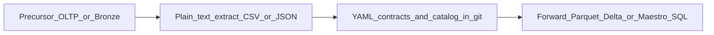
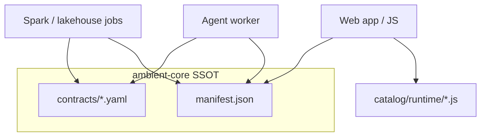

# Governed data: catalog and contracts

This guide answers how **catalog** and **contracts** are used in practice and how to build on top of them without duplicating SSOT in your application repository.

Naming, integer ids, serialization formats, and where databases sit relative to git are defined in [CONVENTIONS.md](CONVENTIONS.md). This page focuses on consumption and the end-to-end data flow.

For catalog YAML authoring, see [catalog/README.md](../catalog/README.md). For contract file layout in this repo, see [contracts/README.md](../contracts/README.md). For agents that read metadata via tools, see [AGENTS.md](AGENTS.md) and [agent-security.md](agent-security.md).

## Plain text SSOT and data flow

Ambient Core owns the **middle** layer: human-authored **YAML** for contracts and catalog semantics (plus Maestro **config**), and machine-generated **JSON** (`catalog/manifest.json`, JSON Schemas, bronze mapping payloads) and **JavaScript** (`catalog/runtime/*.js` from `ambient-catalog-generate`). Do not maintain a second editable copy of those trees in a consumer repo — pin a tagged checkout or submodule ([INTEGRATING.md](INTEGRATING.md), [CANONICAL_SCOPE.md](CANONICAL_SCOPE.md)).

Operational databases and lakehouse Bronze are **precursors**: data is extracted to plain text (typically **CSV/TSV** or **JSON**) at the upload boundary before governance runs. Maestro emits **JSONL** run-complete lines at the service boundary ([CONVENTIONS.md](CONVENTIONS.md#choosing-a-format)). Silver → Gold and similar **forward** stores are Parquet/Delta or service SQL in deployment; their shapes are still defined by YAML in `contracts/`. Details: [CONVENTIONS.md — Data formats and storage](CONVENTIONS.md#data-formats-and-storage).



Medallion job steps that implement this path are in [pipeline.md](pipeline.md).

## Two layers

- **Catalog** — reference KPIs, industries, data-source templates, benchmarks (semantic intent, not physical tables). SSOT: authored **YAML** under `catalog/` → generated **`manifest.json`** (JSON) and `catalog/runtime/*.js`.
- **Contracts** — governed **data-product** interfaces: schema, lineage, quality, consumption rules. SSOT: **YAML** in `contracts/` (bundled in wheels as `ambient_contracts.bundled`).

Catalog metrics do **not** replace contracts. A metric may exist in the catalog long before a Gold product is defined. Optional links are recorded in [crosswalk.yaml](../catalog/crosswalk.yaml) — see [crosswalk.md](crosswalk.md).

## Path resolution

Python and CLIs resolve paths via [lib/ambient_contracts/paths.py](../lib/ambient_contracts/paths.py):

- **`AMBIENT_CORE_ROOT`** — repo root (submodule or clone)
- **`AMBIENT_CONTRACTS_DIR`** — override contracts directory (default: `contracts/` under root, or wheel bundle)
- **`AMBIENT_CATALOG_DIR`** — catalog tree containing `manifest.json`

**Wheel-only installs** ship bundled contracts; catalog tools and `load_manifest()` need a full checkout or `AMBIENT_CATALOG_DIR` pointing at a tree with `manifest.json`. Agent tool definitions mark catalog tools with `requires_env: [AMBIENT_CORE_ROOT]` for the same reason.

Set these in CI before `validate-contracts` and `ambient-catalog-generate --check` when core is a submodule — see [INTEGRATING.md](INTEGRATING.md).

## How each consumer uses the same SSOT



### UI and planning (JavaScript or JSON)

- Import generated modules from `catalog/runtime/` (industries, metrics, enrichment) or read `catalog/manifest.json` directly.
- Use catalog for **labels, methodology, required sources** — not for asserting warehouse table shapes.
- Field-level manifest guidance: [catalog-consumption.md](catalog-consumption.md).

### Pipelines and notebooks (Python)

- **Contracts:** `ContractLoader` from `ambient_contracts` — load YAML, `assert_required_columns()` on Spark DataFrames, `enforce_bronze_lineage()` before Silver/Gold writes.
- **Catalog:** `load_manifest()` for metric lists; `ambient_pipeline.catalog_loader.load_data_option()` for upload-mapping rules tied to industry YAML.
- **Governance helpers** (git checkout, not full wheel): `ambient_pipeline` — provenance stamping, PII pseudonymization, bronze→tenant-metrics mapping. See [pipeline.md](pipeline.md).

Execution (Databricks jobs, schedules, Firestore sync) lives in **your application repository**; core supplies contracts, catalog semantics, and reusable helpers.

### Agents (plan-execute worker)

Core built-in tools in [lib/ambient_agent/tools.py](../lib/ambient_agent/tools.py):

- **`catalog_list_metrics`** — slice of `manifest.json` metrics (optional `industry`, `limit`)
- **`catalog_resolve_metric`** — one metric by `metric_id` (string id from manifest)
- **`contracts_list`** — basenames of `*.yaml` in the resolved contracts dir
- **`contracts_validate`** — structural validation for one file or all contracts

`run_plan_execute()` walks a profile’s fixed `tool_ids`, then sends observations to Maestro. Default args for `catalog_resolve_metric` use the first 128 characters of `user_message` as `metric_id` — for production, call `execute(tool_id, explicit_args, ...)` from your worker. Live Gold values and job triggers are **platform** tools via `register_tool()` — not in core.

Set `AgentRunContext.contract_refs` and `catalog_refs` in your worker to include **policy hints** in the synthesis prompt (basenames / metric ids). They do not restrict which tools run or enforce authorization.

The crosswalk is **not** read by agent tools. Apps may load links with `ambient_contracts.crosswalk.load_crosswalk_links()` — see [crosswalk.md](crosswalk.md).

## CI gates

From a core checkout:

```bash
validate-contracts
ambient-catalog-generate --check
validate-agent-config   # if you ship or fork agent profiles
```

## Data-product inventory

- [tenant-metrics-v1.yaml](../contracts/tenant-metrics-v1.yaml) — Silver tenant metric snapshots; bronze lineage; multi-tenant isolation
- [org-kpi-v1.yaml](../contracts/org-kpi-v1.yaml) — Gold org KPIs by vertical
- [quality-v1.yaml](../contracts/quality-v1.yaml) — Data quality and lineage product
- [opportunity-v1.yaml](../contracts/opportunity-v1.yaml) — Optimization opportunity outputs
- [operational-financial-bridge-v1.yaml](../contracts/operational-financial-bridge-v1.yaml) — Operational–financial bridge
- [commercial-usage-v1.yaml](../contracts/commercial-usage-v1.yaml) — Commercial usage snapshot
- [observability-pipeline-v1.yaml](../contracts/observability-pipeline-v1.yaml) — Medallion/pipeline health (often references platform deploy assets)
- [maestro-run-v1.yaml](../contracts/maestro-run-v1.yaml) — Maestro run artifact schema (inference, not medallion data)

Open the YAML for table names, required columns, and consumption rules. `validate-contracts` checks structural keys (`product`, `schema`, `lineage`, `governance`); deeper semantics are enforced in pipeline code and tests.

## Crosswalk

See [crosswalk.md](crosswalk.md) for field definitions, the in-repo DSCR example, and maintainer workflow.

## Build on top (checklist)

1. Pin a tagged `ambient-core` release — [INTEGRATING.md](INTEGRATING.md).
2. Set `AMBIENT_CORE_ROOT` / contract and catalog dirs in CI.
3. Gate merges with `validate-contracts` and `ambient-catalog-generate --check`.
4. Jobs: load contracts and catalog rules in Python; do not copy YAML into app-only trees.
5. UI: consume `manifest.json` or `catalog/runtime/` from the pinned checkout.
6. Agents: `run_plan_execute` from a worker; register tenant-specific tools in the platform repo.

Try the minimal Python walkthrough: [examples/pipeline/minimal_governed_data.py](../examples/pipeline/minimal_governed_data.py).

## Anti-patterns

- Maintaining a second editable `contracts/` or generated `manifest.json` outside the pinned core checkout.
- Encoding KPI definitions only in LLM prompts instead of catalog + contracts.
- Expecting core agents to run pipelines or query live Gold — add `register_tool()` handlers in your app and keep secrets off the client.
- Using `contracts_validate` or `ContractLoader` with user-supplied paths without basename checks in **your** API layer (core agent tool validates basenames only).

## Related

- [catalog-consumption.md](catalog-consumption.md) — manifest vs YAML vs JS runtime
- [crosswalk.md](crosswalk.md) — metric → contract links
- [USAGE.md](USAGE.md) — install recipes
- [pipeline.md](pipeline.md) — bronze → contract flow with `ambient_pipeline`
- [CONVENTIONS.md](CONVENTIONS.md) — catalogue keys, contract versions, formats and storage
- [CANONICAL_SCOPE.md](CANONICAL_SCOPE.md) — what must change only here
- [CORE_VS_PLATFORM.md](CORE_VS_PLATFORM.md) — foundation vs full product repo
