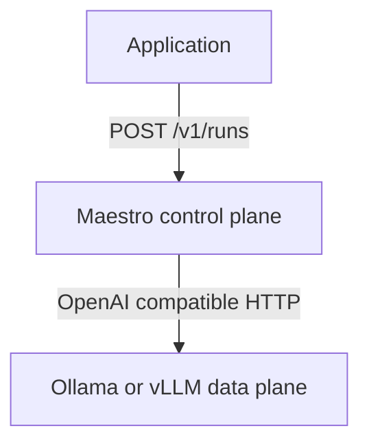
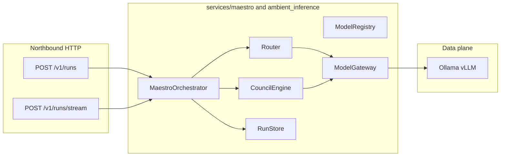

# Inference layer (Maestro)

Headless, API-first intelligence: **open-weight models only**, intelligent routing, and a **model council** orchestrator. Clients call Maestro over HTTP; consumption apps should not host GPU inference or embed API keys for proprietary LLMs.

**Maestro is the control plane.** It does not run models — it orchestrates them (see [Architecture: control plane vs data plane](#architecture-control-plane-vs-data-plane) below).

**Related:** [contracts/maestro-run-v1.yaml](../contracts/maestro-run-v1.yaml) (run artifact contract). Downstream apps call this service over HTTP; deploy wiring lives in the consumer repository. Optional assist for raw upload → catalog column mapping is described in [maestro-catalog-ingestion.md](maestro-catalog-ingestion.md) (not SSOT for catalog or post-ingest quality).

---

## Responsibilities

- **Maestro API** — `POST /v1/runs`, streaming via `POST /v1/runs/stream`, run lookup and event replay.
- **Router** — policy-driven model selection plus optional classifier pass; fallback chains on backend errors.
- **Council** — `council_research` workflow: parallel drafts → chair synthesis (MVP).
- **Run store** — SQL persistence (`runs`, `run_events`) with optional `org_id` for tenancy and future metering.

---

## Architecture: control plane vs data plane

Maestro is an **orchestration / control layer** for open-weight models. It does not host model weights. It decides which model(s) to use, how to route between them, whether to run a single model or a **council**, and how to handle streaming, persistence, and events.

This is analogous to SDN (Software-Defined Networking):

- **Data plane** (SDN) → **Ollama / vLLM** in Maestro — actual models; inference
- **Control plane** → **Maestro** (`lib/ambient_inference`, `services/maestro`) — routing, council, run lifecycle
- **Southbound API** → OpenAI-compatible calls via `ModelGateway` — how Maestro talks to backends
- **Northbound API** → `POST /v1/runs`, stream, run lookup — how applications talk to Maestro





**HTTP entrypoint** — [`services/maestro/main.py`](../services/maestro/main.py):

- `GET /health` and `GET /ready` — liveness/readiness probes (no API key; restrict at ingress in production).
- `GET /v1/models`, `POST /v1/runs`, run lookup — API key when `AMBIENT_MAESTRO_API_KEY` is set.
- `POST /v1/runs/stream` — persists events to `RunStore` and fans out SSE to the client.

**Library wiring** — [`services/maestro/deps.py`](../services/maestro/deps.py) builds `ModelRegistry`, `ModelGateway`, `Router`, `CouncilEngine`, `RunStore`, and `MaestroOrchestrator`.

For how Ambient Core compares to agent frameworks and governance suites, see [POSITIONING.md](POSITIONING.md).

---

## Repository layout

- [`lib/ambient_inference/`](../lib/ambient_inference/) — core library
- [`services/maestro/`](../services/maestro/) — FastAPI service
- [`config/`](../config/) — models, routing policies, council profiles

---

## Local development

### Python only (unit tests, no GPU)

```bash
pip install -e ".[dev]"
validate-inference-registry
pytest -q
```

### Maestro API on the host

```bash
pip install -e ".[dev]"
set MAESTRO_USE_CLASSIFIER=false
uvicorn main:app --app-dir services/maestro --reload --port 8088
```

Point backends at Ollama (OpenAI-compatible base URL):

- **MAESTRO_BACKEND_QWEN32B_URL** — e.g. `http://127.0.0.1:11434`
- **MAESTRO_BACKEND_DEEPSEEK14B_URL** — same host; model name comes from [`config/models.yaml`](../config/models.yaml) `backend_model`
- **MAESTRO_BACKEND_LLAMA70B_URL** — chair / synthesizer
- **MAESTRO_BACKEND_CLASSIFIER_URL** — small model for routing (optional if `MAESTRO_USE_CLASSIFIER=false`)
- **MAESTRO_BACKEND_PHI_URL**, **MAESTRO_BACKEND_QWEN_CODER_URL**, **MAESTRO_BACKEND_GEMMA_URL** — optional backends for newer registry ids (see [Recommended open models (2026)](#recommended-open-models-2026))

Optional:

- **AMBIENT_MAESTRO_API_KEY** — if set, clients must send `X-Api-Key` or `Authorization: Bearer`
- **MAESTRO_MAX_REQUEST_BODY_BYTES** — default `1048576`; set `0` to disable the request body cap
- **MAESTRO_DATABASE_URL** — default `sqlite:///./maestro_runs.db`; use Postgres in platform Docker Compose

### Docker Compose (optional — consumer repo)

A **production-like stack** (Postgres + Ollama + Maestro together) is typically wired in the **application repository** that deploys Maestro—not required for core-only development above.

Use your consumer’s compose file and image build that clones or installs this project at a pinned tag.

### End-to-end (live Ollama / vLLM)

```bash
set MAESTRO_E2E_URL=http://127.0.0.1:8088
set AMBIENT_MAESTRO_API_KEY=dev-local-key
pytest tests/test_e2e_ollama.py -m gpu -q
```

---

## Run telemetry and tuning

Each completed or failed run emits one **`maestro_run_complete`** JSONL line (one JSON object on stdout and in logger `ambient_inference.maestro`) — forward-cursor operational telemetry, not catalog SSOT; see [CONVENTIONS.md](CONVENTIONS.md#choosing-a-format). The **run store** (`runs`, `run_events`) is SQL via **MAESTRO_DATABASE_URL** — see [CONVENTIONS.md — forward cursors](CONVENTIONS.md#where-databases-fit-precursors-and-forward-cursors).

Adjust [`config/routing_policies.yaml`](../config/routing_policies.yaml) and [`council_profiles.yaml`](../config/council_profiles.yaml) based on failures and latency; add unit tests under [`tests/`](../tests/) when changing router behavior.

---

## Adding an open-weight model

1. Add an entry to [`config/models.yaml`](../config/models.yaml) with `family` in the allowlist (see `validate-inference-registry`).
2. Set the corresponding **`MAESTRO_BACKEND_*_URL`** in the runtime environment — never in Git.
3. Reference the model id in routing policies or a council profile.
4. Run `validate-inference-registry` and `pytest`.

---

## Council profiles

Defined in [`config/council_profiles.yaml`](../config/council_profiles.yaml).

- **council_research** — `parallel_draft_synthesize` for `research_qa` tasks.
- **single_chat** — one-model baseline.

---

## Recommended open models (2026)

Registry ids in [`config/models.yaml`](../config/models.yaml) (and [`models.recommended.yaml`](../lib/ambient_inference/default_config/models.recommended.yaml) as an optional `MAESTRO_MODELS_FILE` alias). Backend URLs are **environment variables**; model tags below are typical **Ollama** library names—verify with `ollama pull` on your host because tags change over time.

- **Classifier / fast chat** — registry id `qwen2.5-1.5b-instruct`, typical Ollama tag `qwen2.5:1.5b-instruct`, env `MAESTRO_BACKEND_CLASSIFIER_URL`
- **Fast summarizer / auditor** — `phi-4-mini`, `phi4:mini`, `MAESTRO_BACKEND_PHI_URL`
- **General chat / drafts** — `qwen2.5-32b-instruct`, `qwen2.5:32b-instruct`, `MAESTRO_BACKEND_QWEN32B_URL`
- **Code-oriented (capability tag)** — `qwen2.5-coder-14b`, `qwen2.5-coder:14b`, `MAESTRO_BACKEND_QWEN_CODER_URL`
- **Reasoning fallback** — `deepseek-r1-distill-qwen-14b`, `deepseek-r1:14b`, `MAESTRO_BACKEND_DEEPSEEK14B_URL`
- **Balanced instruct** — `gemma3-12b-instruct`, `gemma3:12b`, `MAESTRO_BACKEND_GEMMA_URL`
- **Council chair / synthesis** — `llama-3.3-70b-instruct`, `llama3.3:70b`, `MAESTRO_BACKEND_LLAMA70B_URL`

Task types **`summarizer_fast`** and **`auditor_chat`** in [`routing_policies.yaml`](../config/routing_policies.yaml) target `phi-4-mini` when configured. Agent profiles in [`lib/ambient_agent/agent_profiles.yaml`](../lib/ambient_agent/agent_profiles.yaml) map to Maestro modes (`council_research`, `single_chat`) and router `task_type` values—see [AGENTS.md](AGENTS.md).

The `tool_calling` capability on `qwen2.5-coder-14b` is **documentation-only** until Maestro run requests carry native tool schemas.

---

## Security

- API keys and backend tokens live in env / secret stores only.
- Pass **`X-Org-Id`** (or `org_id` in the body) for tenant attribution on runs.

**Production checklist**

- Set **`AMBIENT_MAESTRO_API_KEY`** on any Maestro instance reachable outside a trusted dev machine. When unset, the HTTP API accepts unauthenticated requests (local quick start only).
- Clients may send the key as **`X-Api-Key`** or **`Authorization: Bearer <key>`**. Comparison uses a timing-safe digest when a key is configured.
- **`GET /health`** and **`GET /ready`** stay unauthenticated for orchestrator probes. Restrict network access (VPC, ingress auth, or private listeners) in deployed environments.
- **`MAESTRO_MAX_REQUEST_BODY_BYTES`** — maximum request body size (default `1048576`). Set to `0` to disable the cap. Oversized bodies (per `Content-Length`) receive HTTP **413**.
