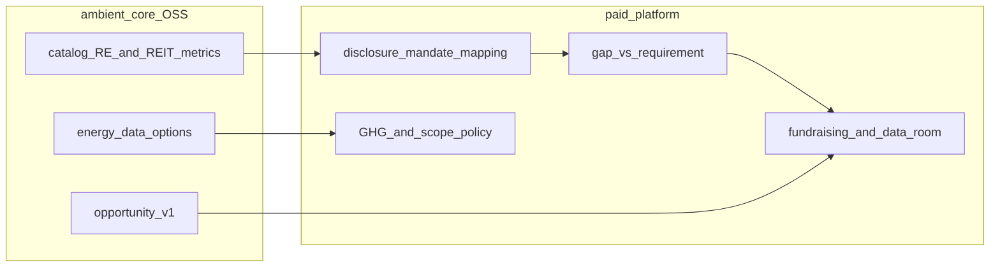

# Investor disclosure and fundraising lifecycle: core vs platform

**Investor disclosure** (and related **fundraising** readiness) is the work cycle that asks whether an organization meets **stakeholder mandates** for reporting—so capital remains available from listed markets, limited partners, sponsors, or lenders with climate or sustainability expectations. It is not the same as [benchmarking](benchmarking-lifecycle.md) (peer performance) or [assurance](assurance-lifecycle.md) (defensibility of numbers)—but published metrics should be traceable through assurance, and operational definitions should match those used in benchmarks.

ambient-core supplies **metric vocabulary** and contract shapes; the **paid platform** maps mandates, computes gap-to-requirement, and supports remediation narratives and data rooms.

Index of all cycles: [work-cycles.md](work-cycles.md).

This document is **not legal or securities advice**; it describes product architecture only.

## End-to-end flow

## Phase mapping

### 1. Audience and mandate mapping

- **Core** — Analysis lens per org ([governed-data.md](governed-data.md)); sector profiles for comparison **design**, not legal obligation lists.
- **Platform** — `disclosure_mandate_id`, `investor_audience` (listed exchange, LP, sponsor, lender); checklist per jurisdiction or fund policy (for example exchange sustainability reporting expectations for listed real estate, portfolio-level carbon disclosure demanded by institutional LPs). Map mandates to catalog metric ids and contract products.

### 2. Metric pack selection

- **Core** — Real Estate operating metrics (NOI, cap rate, occupancy where defined); listed REIT investor metrics under `financial_services.reits.*` in [financial_services.yaml](../catalog/industries/financial_services.yaml); energy consumption fields on Real Estate data options (`energy_consumed`, `energy_cost`). Bridge rules link energy signals to financial impact narratives.
- **Platform** — Curated “investor pack” per mandate; effectiveness metrics (growth, distributions) versus efficiency and environmental intensity grouped for disclosure schedules.

**Catalog gap (v1):** There is no dedicated `sustainability` segment or native GHG metrics in core yet. Intensity-style environmental KPIs (for example per megawatt, PUE) are expected to be platform-normalized or added in a future catalog band—not invented in prompts.

### 3. Boundaries and harmonization

- **Core** — Documented methodologies and `calc` boundaries per metric; intensity metrics where authored in catalog.
- **Platform** — GHG scope boundaries, tenant versus landlord energy, currency and period alignment, restatement and versioned disclosure files.

### 4. Gap versus requirement

- **Core** — [benchmarks.yaml](../catalog/core/benchmarks.yaml) healthy bands are **planning guardrails**, not exchange or LP thresholds.
- **Platform** — Required versus actual versus prior period; optional peer percentile for **narrative** only when mandate references market practice. Success criterion is **compliance or mandate gap**, not pace-setter rank.

### 5. Remediation, fundraising, and data room

- **Core** — `fpaWorkflow` hints on metrics; [opportunity-v1.yaml](../contracts/opportunity-v1.yaml) governs the **shape** of optimization or remediation recommendations (confidence, lineage)—populated in deployment.
- **Platform** — CapEx and retrofit roadmaps, sustainability action owners, data-room exports, equity or debt storytelling tied to catalog metric keys.

## Overlap: benchmark cycle vs disclosure cycle on the same org

Run **benchmarking** when the user needs peer context and improvable decomposition (for example NOI margin versus another data-centre REIT). Run **disclosure** when the user must satisfy a **named mandate** (exchange, fund, lender) even if peers are strong or weak. The same tenant org may run both in one quarter; use separate metadata (`peer_group_id` vs `disclosure_mandate_id`) and do not treat mandate compliance as “winning” a benchmark.

Listed issuers may face **regulatory or exchange** sustainability disclosure pressure; **private** capital may impose parallel portfolio-level reporting on the same assets through LP agreements. Platform modeling as separate mandates on the same or sibling orgs under one `reporting_group_id` matches [analysis lens](governed-data.md#analysis-lens-and-multi-org-tenancy) patterns.

## Illustrative data-centre REIT sketch

**Setup.** A listed data-centre REIT org under Real Estate / REIT investor lenses; a related mandate from an LP portfolio policy on energy and carbon transparency.

**Definitions (core).** Occupancy and NOI margin semantics from Real Estate pack; FFO and payout from `financial_services.reits.*`; energy uploads from Real Estate data options where available.

**Mandates (platform).** Exchange-style sustainability schedule plus fund policy fields not fully enumerated in core.

**Gap (platform).** Missing intensity metrics or undisclosed PUE where mandate requires them—gap to **requirement**, not to a peer REIT.

**Remediation (platform).** Efficiency and procurement initiatives; optional opportunities written to Gold per `opportunity-v1`. Empirical filings and figures remain in external research or issuer disclosures.

## Related

- [work-cycles.md](work-cycles.md)
- [benchmarking-lifecycle.md](benchmarking-lifecycle.md)
- [assurance-lifecycle.md](assurance-lifecycle.md)
- [governed-data.md](governed-data.md)
- [catalog-consumption.md](catalog-consumption.md)
- [opportunity-v1.yaml](../contracts/opportunity-v1.yaml)
