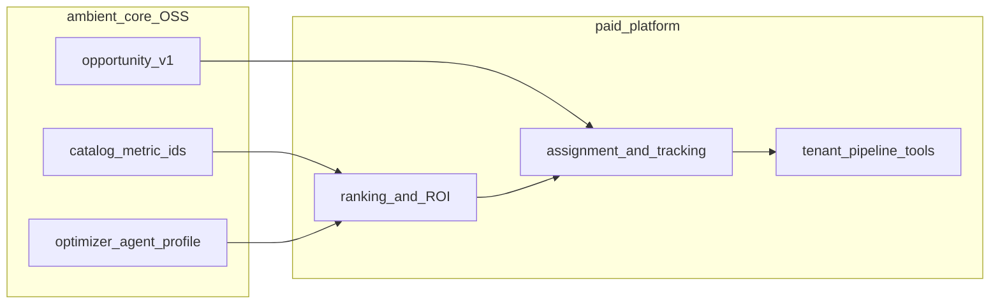

# Optimization lifecycle: core vs platform

**Optimization** asks which **actions** to take, in what priority, with confidence and lineage back to catalog metrics. It follows diagnosis: [benchmarking](benchmarking-lifecycle.md) improvable gaps, [planning variance](planning-variance-lifecycle.md), bridge variances from [assurance](assurance-lifecycle.md), or [disclosure](investor-disclosure-lifecycle.md) remediation needs.

ambient-core defines the **opportunity Gold shape** and neutral agent boundaries; the **paid platform** runs scoring, assignment, ROI tracking, and fulfillment tools.

Index: [work-cycles.md](work-cycles.md).

## End-to-end flow

## Phase mapping

### 1. Signal intake

- **Core** — Catalog metric definitions and `calc` dependencies; [operational-financial-bridge-v1.yaml](../contracts/operational-financial-bridge-v1.yaml) variance signals; benchmark or variance observations from platform analytics (not stored in OSS).
- **Platform** — Rules for when to open an optimization case; optional `optimization_run_id` in run metadata.

### 2. Opportunity generation

- **Core** — [opportunity-v1.yaml](../contracts/opportunity-v1.yaml) governs Gold columns: `opportunity_id`, title, description, `confidence_score`, `estimated_monthly_impact`, `linked_metric_ids`, lineage fields. Contract description references platform-side logic (including patented scoring); **OSS does not implement that scoring engine**.
- **Platform** — Model or rules that create and update `gold.optimization_opportunities` rows with full lineage.

### 3. Agent-assisted exploration (optional)

- **Core** — `optimizer` profile in [agent_profiles.yaml](../lib/ambient_agent/agent_profiles.yaml): `contracts_list`, `catalog_list_metrics`, `catalog_resolve_metric`, Maestro `council_research` synthesis grounded in observations only.
- **Platform** — `register_tool()` handlers for live metrics, job triggers, tickets; secrets and tenant authZ per [agent-security.md](agent-security.md).

### 4. Prioritization and execution

- **Core** — `fpaWorkflow` hints on linked metrics for human interpretation.
- **Platform** — Rank by ROI and confidence, assign owners, monitor completion, close the loop into the next planning or benchmark period.

## Distinct from benchmarking improvement

Benchmarking explains **what** gap exists and which slice is improvable. Optimization persists **ranked recommendations** in governed Gold and drives workflow. Hand off: improvable waterfall slice → opportunity record → fulfillment.

## Examples

- **Manufacturing org:** Opportunity linked to `supply_chain` catalog metrics after sustained scrap or OEE variance.
- **Data-centre REIT org:** Energy or NOI-related opportunity after a disclosure mandate gap; metric keys from Real Estate and `financial_services.reits.*`.
- **Neutral OSS demo:** `optimizer` profile lists catalog metrics for a lens without tenant Gold—synthesis only, no `opportunity-v1` writes.

## What core will not do

- Populate `gold.optimization_opportunities` in production.
- Execute Databricks jobs, billing actions, or writebacks—platform `register_tool()` scope.

## Related

- [work-cycles.md](work-cycles.md)
- [benchmarking-lifecycle.md](benchmarking-lifecycle.md)
- [opportunity-v1.yaml](../contracts/opportunity-v1.yaml)
- [AGENTS.md](AGENTS.md)
- [INTEGRATING.md](INTEGRATING.md)
