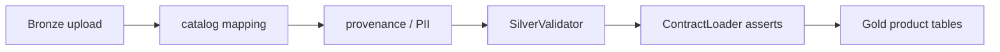

# Pipeline governance helpers

Ambient Core does **not** ship a medallion job runner or Databricks bundle. It ships **contracts**, **catalog** semantics, and Python modules under `lib/ambient_pipeline/` that your lakehouse jobs import. Schedules, notebooks, and deploy glue belong in your application repository.

For catalog vs contracts and path env vars, see [governed-data.md](governed-data.md). For pinning core in a monorepo, see [INTEGRATING.md](INTEGRATING.md).

## What lives where

**In core:** `contracts/*.yaml`; `catalog/` + `manifest.json`; `ambient_pipeline` helpers; `validate-contracts` and the catalog generator CLIs.

**In your app repo:** job definitions, DABs, orchestration; tenant upload UX and entitlements; Firestore sync, OLAP queries, commercial APIs; CI that calls the same CLIs.

[observability-pipeline-v1.0.yaml](../contracts/observability-pipeline-v1.0.yaml) describes pipeline health products and may reference SQL, bundles, or notebooks that are maintained **downstream** — treat it as the interface contract, not as code in this repo.

## Install and test

```bash
git clone <repository-url>
cd ambient-core
pip install -e ".[pipeline,dev]"
set AMBIENT_SPARK_TESTS=1   # Windows; use export on Unix
pytest tests/pipeline/
```

Java 17+ is required for Spark tests.

**Packaging note:** The published wheel includes `ambient_contracts`, `ambient_inference`, `ambient_cli`, and `ambient_agent`. **`ambient_pipeline` requires a git checkout** (tests use `pythonpath = lib` in `pyproject.toml`). Import it from `lib/ambient_pipeline` in notebooks and jobs pinned to the same core tag.

## Typical job flow



1. **Resolve contract** — `ContractLoader.load("tenant-metrics-v1.1.yaml")` (or another product). Call `enforce_bronze_lineage()` before writing Silver/Gold that depends on bronze provenance columns.
2. **Map uploads to catalog shape** — `bronze_catalog_map` and `catalog_loader.load_data_option()` use industry YAML and mapping JSON from uploads. See tests in [tests/pipeline/test_bronze_catalog_map.py](../tests/pipeline/test_bronze_catalog_map.py) and [tests/pipeline/test_catalog_sample_csv_bronze.py](../tests/pipeline/test_catalog_sample_csv_bronze.py).
3. **Stamp lineage** — `BronzeProvenanceStamper` adds `_bronze_*` columns and row hashes ([lib/ambient_pipeline/provenance.py](../lib/ambient_pipeline/provenance.py)).
4. **Validate Silver quality** — `SilverValidator` applies ISO 8000–style checks ([lib/ambient_pipeline/validation.py](../lib/ambient_pipeline/validation.py)).
5. **Assert schema** — `ContractLoader.assert_required_columns()` on the DataFrame column set before publish.

Public re-exports from `ambient_pipeline`: `ContractLoader`, `BronzeProvenanceStamper`, `PiiPseudonymizer`, `SilverValidator` ([lib/ambient_pipeline/__init__.py](../lib/ambient_pipeline/__init__.py)).

## Walkthrough by test module

Use these as executable recipes (run with `AMBIENT_SPARK_TESTS=1` where Spark is involved):

- [test_contracts.py](../tests/pipeline/test_contracts.py) — load tenant-metrics contract; bronze lineage enforcement; required columns
- [test_bronze_catalog_map.py](../tests/pipeline/test_bronze_catalog_map.py) — mapping JSON, CSV header validation, stable metric ids
- [test_catalog_sample_csv_bronze.py](../tests/pipeline/test_catalog_sample_csv_bronze.py) — end-to-end bronze CSV against catalog field rules
- [test_catalog_manifest.py](../tests/pipeline/test_catalog_manifest.py) — manifest loading in pipeline context
- [test_validation.py](../tests/pipeline/test_validation.py) — Silver validation rules

## Minimal example (no Spark)

From a core clone with `pip install -e .`:

```bash
set AMBIENT_CORE_ROOT=%CD%
python examples/pipeline/minimal_governed_data.py
```

See [examples/pipeline/README.md](../examples/pipeline/README.md).

## Agents and pipelines

Core agents read **metadata** via `catalog_*` and `contracts_*` tools; they do not run Spark jobs. To let an agent trigger a pipeline or read live Gold, register tools in your worker — [AGENTS.md](AGENTS.md).

## Related

- [USAGE.md](USAGE.md) — recipe 4 (pipeline pytest)
- [governed-data.md](governed-data.md) — catalog + contracts consumption
- [CORE_VS_PLATFORM.md](CORE_VS_PLATFORM.md) — scope split
