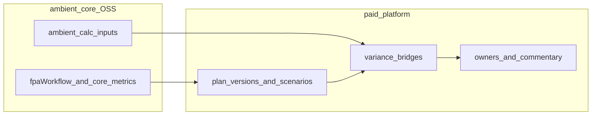

# Planning and variance lifecycle: core vs platform

**Planning and variance** asks how **actuals** compare to the organization’s own **plan**—budget, forecast, or board case—and what explains the gap. The baseline is internal intent, not a peer ([benchmarking-lifecycle.md](benchmarking-lifecycle.md)).

**FP&A close** on [work-cycles.md](work-cycles.md) is the recurring rhythm (close calendar, board packs); this cycle is the **plan-vs-actual analytical product** built on the same catalog metrics.

Index: [work-cycles.md](work-cycles.md).

## End-to-end flow

## Phase mapping

### 1. Metric and calendar alignment

- **Core** — `*.core.*` close metrics (margins, growth, working capital, cash flow); segment operational metrics per analysis lens; `fpaWorkflow` strings describing typical FP&A use on each row in catalog YAML.
- **Platform** — Fiscal calendar, plan version locking, mapping actuals period to plan period; metadata `plan_version_id`, optional `scenario_id` (base, upside, downside).

### 2. Plan storage and scenarios

- **Core** — No plan SSOT in ambient-core; plans are tenant data in the platform OLTP or lakehouse.
- **Platform** — Versioned budgets and forecasts at catalog metric id granularity (or mapped account trees); scenario comparison UI.

### 3. Variance computation and decomposition

- **Core** — `calc.expr` and `calc.inputs` define how a KPI is built from components; platform uses the same graph for variance bridges (price vs volume vs mix) where inputs exist.
- **Platform** — Variance waterfalls, commentary, accountability by department; not peer-ranked.

### 4. Close integration

- **Core** — Assurance and bridge products may explain why actuals moved before variance is finalized.
- **Platform** — Tie variance cycle to close status, reforecast triggers, board deck export.

## Distinct from benchmarking

Benchmarking diagnoses performance versus **external** pace-setters and improvable structural gaps. Planning variance diagnoses performance versus **yesterday’s plan**. The same metric (for example `operating_margin`) can run through both cycles in one quarter with different metadata (`peer_group_id` vs `plan_version_id`).

## Examples

- **Any lens:** Quarterly actual `revenue_growth` and `ebitda_margin` vs annual budget using `industry.core.*` metrics after catalog expansion.
- **Aviation network carrier org:** Actual CASM/RASM vs operating plan using `aviation.network_carrier.*` definitions; variance on fuel and load factor inputs.
- **Retail org:** Same-store sales growth actual vs plan using `retail.operations.same_store_sales_growth`.

## Related

- [work-cycles.md](work-cycles.md)
- [benchmarking-lifecycle.md](benchmarking-lifecycle.md)
- [catalog/README.md](../catalog/README.md#terminology)
- [lib/ambient_calc](../lib/ambient_calc/__init__.py)
