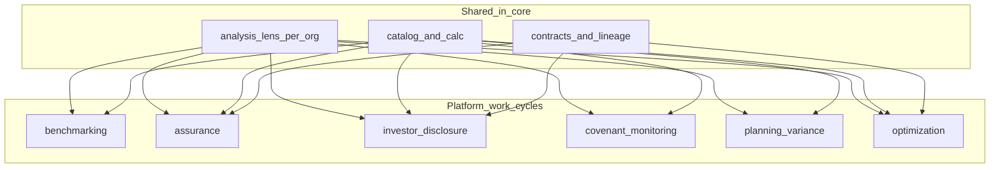

# Product work cycles (hub)

A **paid multi-tenant platform** (not ambient-core) orchestrates several **work cycles** on top of the same governed metrics. Each cycle answers a different question but shares prerequisites: a **tenant organization**, an [analysis lens](governed-data.md#analysis-lens-and-multi-org-tenancy) (catalog industry and segment), and a pinned **ambient-core** release for catalog and contract SSOT.

**ambient-core** supplies KPI definitions, methodologies, `calc` specs, healthy bands, sector profiles, and Gold contract shapes. The **platform** supplies tenancy, workflows, peer or mandate data, UI, and commercial features.

## Work cycles documented

### Benchmarking

**Question:** Who performs better on chosen KPIs, what is the gap versus a pace-setter, and which part of the gap is structural versus improvable?

Core provides definitions, sector profiles, `benchmarks.yaml` guardrails, and formula inputs. The platform provides peer cohorts, normalization, gap analytics, waterfalls, and improvement tied to [opportunity-v1.yaml](../contracts/opportunity-v1.yaml).

Detail: [benchmarking-lifecycle.md](benchmarking-lifecycle.md).

### Assurance

**Question:** Can we **defend** this number—with lineage, data quality, and operational–financial alignment—to lenders, regulators, internal control, or external assurance?

Core provides [quality-v1.yaml](../contracts/quality-v1.yaml), [operational-financial-bridge-v1.yaml](../contracts/operational-financial-bridge-v1.yaml), pipeline lineage rules, and catalog methodology. The platform provides control packs, sign-off, assurance exports, and read-only auditor views.

Detail: [assurance-lifecycle.md](assurance-lifecycle.md).

### Investor disclosure and fundraising

**Question:** Do we meet **stakeholder mandates** (exchange disclosure, LP or sponsor portfolio policy, lender-linked reporting) needed for capital access—not merely “are we better than peers?”

Core provides the same metric vocabulary (for example Real Estate operations, `financial_services.reits.*`, energy-related data options). The platform maps mandates, gap-to-requirement, remediation, and data-room or fundraising narratives.

Detail: [investor-disclosure-lifecycle.md](investor-disclosure-lifecycle.md).

### Covenant monitoring

**Question:** Are we within **covenant or policy thresholds** (lender, bond, treasury), what is headroom, and which catalog drivers move DSCR, LTV, coverage, or capital metrics?

Core provides covenant-adjacent metric definitions, DSCR guardrails in `benchmarks.yaml`, and ops–finance bridge contracts. The platform stores facility terms, test schedules, waivers, and alerts.

Detail: [covenant-lifecycle.md](covenant-lifecycle.md).

### Planning and variance

**Question:** How do **actuals** compare to our **plan** (budget, forecast, board case), and what explains variance?

Core provides `fpaWorkflow`, `*.core.*` close metrics, and `calc` input structure. The platform stores plan versions, scenarios, variance bridges, and commentary.

Detail: [planning-variance-lifecycle.md](planning-variance-lifecycle.md).

### Optimization

**Question:** What **actions** should we take, in what order, with confidence and lineage to catalog metrics?

Core provides [opportunity-v1.yaml](../contracts/opportunity-v1.yaml) and the neutral `optimizer` agent profile. The platform scores, ranks, assigns, and fulfills opportunities (including patented logic described in the contract, not shipped in OSS).

Detail: [optimization-lifecycle.md](optimization-lifecycle.md).

### FP&A close (product function, not a separate lifecycle doc)

**Rhythm:** Monthly or quarterly close, covenant liquidity, board packs—expressed via `fpaWorkflow` on catalog metrics and `*.core.*` close metrics. FP&A consumes the cycles above; planning variance is the usual analytical layer on top of close. See [catalog/README.md](../catalog/README.md#terminology).

## Further cycles (not documented yet)

These fit the same architecture (lens + catalog + platform workflow) but do not have lifecycle pages in core v1:

- **Regulatory submission** — supervisory templates and stress tests (Banking, Insurance lenses).
- **M&A and diligence** — confidential, time-boxed compare and assure on a target org.
- **Incident and variance response** — short SLA on bridge or DQ breaks ([operational-financial-bridge-v1](../contracts/operational-financial-bridge-v1.yaml), [quality-v1](../contracts/quality-v1.yaml)).
- **Holdco roll-up** — aggregate across orgs with different lenses via `reporting_group_id`.
- **Commercial metering** — product usage billing ([commercial-usage-v1](../contracts/commercial-usage-v1.yaml)).

## Platform metadata conventions

Core does not validate these; document them in your worker for consistent logging and synthesis prompts. See also [catalog-consumption.md](catalog-consumption.md#analysis-lens-and-metric-filtering).

- **`org_id`** — tenant organization.
- **`catalog_industry`** — resolved analysis lens (pack label).
- **`reporting_group_id`** — optional legal or group rollup link.
- **`peer_group_id`** — benchmarking cohort.
- **`assurance_framework`** or **`control_pack_id`** — assurance scope (for example lineage plus bridge controls).
- **`disclosure_mandate_id`** — named requirement set (exchange checklist, fund policy).
- **`investor_audience`** — coarse audience (listed, LP, lender, internal).
- **`covenant_pack_id`** or **`facility_id`** — lender or bond covenant mapping.
- **`plan_version_id`** — locked budget or forecast version.
- **`scenario_id`** — plan scenario (base, upside, downside).
- **`optimization_run_id`** — optional batch id for opportunity generation.

## Do not conflate “audit” in this repository

Three different ideas appear in core docs and code:

- **Assurance work cycle** — defend metrics with quality, lineage, and ops–finance alignment ([assurance-lifecycle.md](assurance-lifecycle.md)).
- **`auditor` agent profile** — plan-execute profile using `contracts_validate` and governance-oriented synthesis ([AGENTS.md](AGENTS.md)); not a financial audit product.
- **Pipeline audit logs** — immutable run and performance events in [observability-pipeline-v1.yaml](../contracts/observability-pipeline-v1.yaml) for forensics and compliance evidence.

## Related

- [governed-data.md](governed-data.md) — catalog vs contracts; analysis lens
- [CORE_VS_PLATFORM.md](CORE_VS_PLATFORM.md) — what stays in the application repo
- [INTEGRATING.md](INTEGRATING.md) — product work cycles for integrators
- [benchmarking-lifecycle.md](benchmarking-lifecycle.md)
- [assurance-lifecycle.md](assurance-lifecycle.md)
- [investor-disclosure-lifecycle.md](investor-disclosure-lifecycle.md)
- [covenant-lifecycle.md](covenant-lifecycle.md)
- [planning-variance-lifecycle.md](planning-variance-lifecycle.md)
- [optimization-lifecycle.md](optimization-lifecycle.md)
